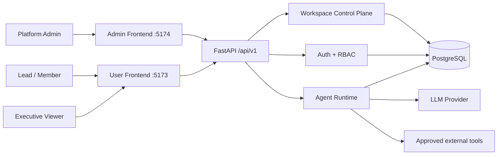
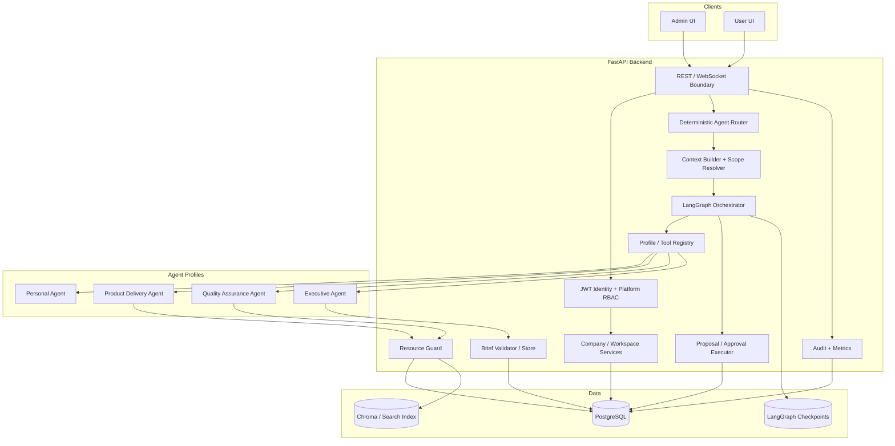
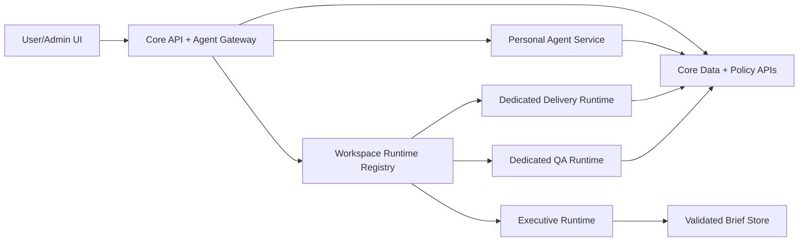
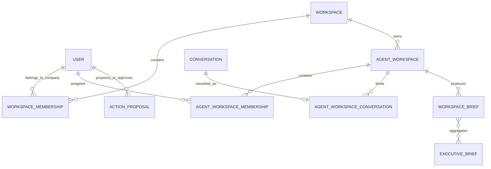
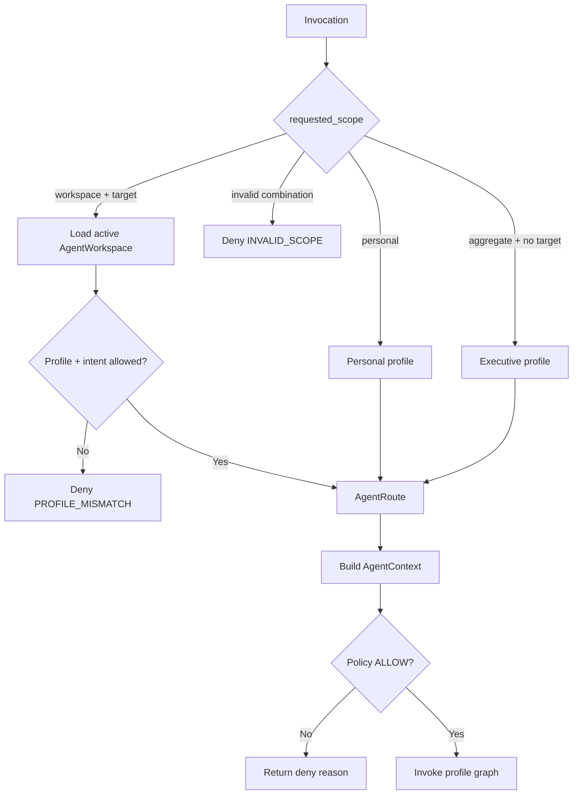
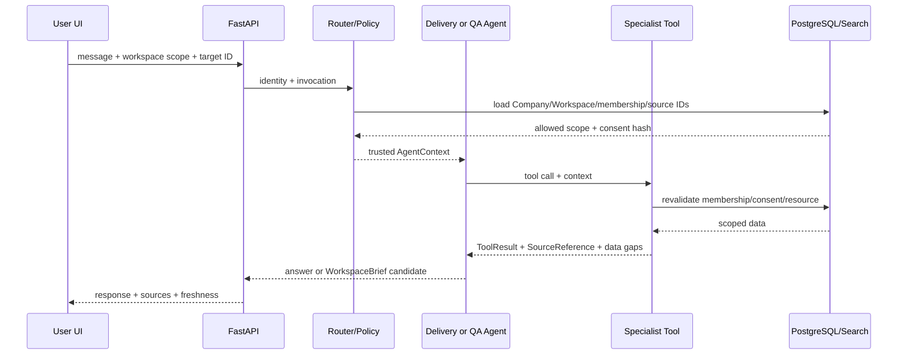
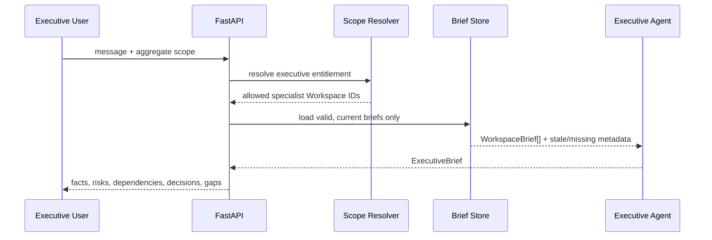
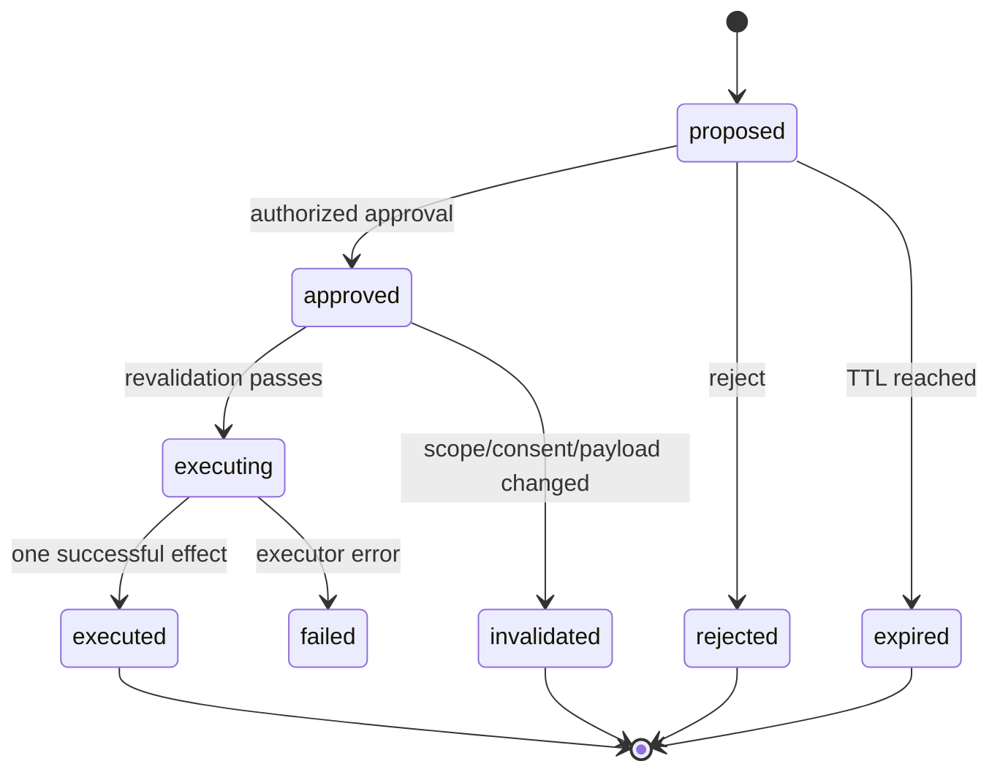

# Architecture — Orbit Multi-Agent theo Workspace

> **Trạng thái:** Canonical v1.1
>
> **Cập nhật:** 2026-08-24
>
> **Phạm vi:** Kiến trúc mục tiêu MVP và trạng thái code hiện tại
>
> **Product requirements:** [PRD](../product/PRD.md)
>
> **Implementation sequencing:** [Multi-Agent Implementation Plan](../implementation/MULTI_AGENT_IMPLEMENTATION_PLAN.md)

## 1. Architectural drivers

Kiến trúc được dẫn dắt bởi sáu yêu cầu:

1. Một logical platform environment đại diện cho một công ty, không có self-service tenant creation; environment
   có thể gồm nhiều service/runtime deployment để cô lập lỗi.
2. Admin kiểm soát Workspace, lead, member và data source.
3. Mỗi Workspace có đúng một Agent profile chuyên môn.
4. Authorization phải hoàn tất trước retrieval và được kiểm tra lại tại tool boundary.
5. Executive chỉ aggregate brief đã validate, không mặc định đọc raw data liên phòng ban.
6. Side effect phải có human approval, idempotency và audit.

## 2. Quyết định kiến trúc

| ID | Quyết định | Lý do |
|---|---|---|
| ADR-01 | Single Company Root `slug=company-root` | App nội bộ một công ty; loại bỏ tenant creation không cần thiết |
| ADR-02 | Workspace sản phẩm được lưu bằng `AgentWorkspace` | Tách phòng ban có Agent khỏi personal/company boundary cũ |
| ADR-03 | Deterministic router | Profile/scope là quyết định quyền, không giao cho LLM suy đoán |
| ADR-04 | Trusted context do server xây | Client không thể tự cấp role, profile hoặc allowed resources |
| ADR-05 | Policy trước prompt, guard lại ở tool | Chống cả retrieval leak và stale permission |
| ADR-06 | Versioned WorkspaceBrief là handoff duy nhất | Hạn chế raw cross-workspace data và giữ provenance |
| ADR-07 | Profile registry + tool allowlist | Least privilege và testability |
| ADR-08 | Proposal/approval tách khỏi execute | Chống side effect ẩn, replay và stale approval |
| ADR-09 | Feature flag theo profile | Rollout/rollback độc lập |
| ADR-10 | Shared control plane, isolated Agent runtimes | Personal và từng Workspace quan trọng có fault domain độc lập mà không copy source code |

## 3. System context



Admin Frontend và User Frontend là hai ứng dụng riêng. Cả hai gọi cùng FastAPI backend; backend là nguồn sự thật duy nhất cho identity, membership, scope và policy.

## 4. Container/component view



### 4.1 Frontend

`Frontend/admin`:

- Đọc Company Root.
- Tạo/update/suspend/archive Agent Workspace.
- Chọn/đổi lead, thêm/revoke member.
- Link/unlink source cho Delivery/QA.
- Xem audit và trạng thái.

`Frontend/user`:

- Liệt kê Workspace từ current membership.
- Không có mutation control plane.
- Mở Agent experience theo profile.
- Hiển thị citation, freshness, data gap và approval.

### 4.2 Backend control plane

- `company_service`: tạo/lấy singleton Company Root.
- `workspace_service`: Company Root membership và legacy personal/organization helpers.
- `agent_workspace_service`: phòng ban, lead/member và conversation binding.
- `admin_routes` + `agent_workspace_routes`: Admin/User API boundary.
- `audit_service`: ghi actor/action/target/workspace/metadata.

### 4.3 Agent platform

- `contracts.py`: Pydantic contracts strict/frozen/versioned.
- `router.py`: chọn profile deterministic từ scope + target record.
- `context_builder.py`: tạo trusted `AgentContext` sau policy.
- `scope_resolver.py`: resolve business role, allowed Workspace và resource.
- `resource_guard.py`: revalidate membership/consent trước tool read.
- `tools/registry.py`: scope, intent, prompt version và tool allowlist theo profile.
- `graph.py`: LangGraph planner/tool/compaction loop và checkpointer.

### 4.4 Deployment fault boundary target

Component view phía trên mô tả modular monolith hiện tại. Production target dùng Hybrid Bridge:



- Personal Agent là service đa user, state namespace theo user/thread.
- Mỗi Workspace quan trọng có runtime deployment độc lập, bind cứng với Agent Workspace/profile.
- Runtime dùng chung contract và image; không copy repository.
- Core giữ identity, membership, consent, policy, Registry và sanitized audit.
- Product Delivery là runtime được tách đầu tiên; Core chuẩn bị authorized snapshot trước khi gọi runtime.
- Nhiều Workspace có thể dùng `dedicated`, `scale_to_zero` hoặc `cell`, nhưng cell chỉ được dùng sau khi
  per-workspace quota và noisy-neighbor tests pass.
- Chi tiết sequencing và release gate nằm tại mục 23–29 của `MULTI_AGENT_IMPLEMENTATION_PLAN.md`.

## 5. Domain model



`WORKSPACE_BRIEF`, `EXECUTIVE_BRIEF` và durable `ACTION_PROPOSAL` trong sơ đồ là **target persistence**; code hiện tại mới có contract in-memory cho brief/proposal, chưa có đầy đủ table/service/API.

### 5.1 Existing tables

| Table | Trách nhiệm | Ràng buộc quan trọng |
|---|---|---|
| `workspaces` | Personal boundary và Company Root | type/status check; singleton theo slug ở service + unique slug |
| `workspace_memberships` | User thuộc Company Root | unique workspace/user; active owner/admin/member mới qua company access |
| `agent_workspaces` | Workspace phòng ban có Agent | unique company/key; profile và status check |
| `agent_workspace_memberships` | Lead/member/executive entitlement | unique workspace/user; partial unique active lead |
| `agent_workspace_conversations` | Source binding | conversation unique toàn mapping; delivery/quality classification |
| `audit_logs` | Security/operation history | actor, target, workspace, metadata |

### 5.2 Target tables

`workspace_briefs` tối thiểu:

- `id`, `schema_version`, `trace_id`
- `organization_workspace_id`, `agent_workspace_id`
- `brief_type`, `producer_profile`, `status`
- `period_start`, `period_end`, `generated_at`, `expires_at`
- structured `headline/facts/risks/dependencies/decisions_needed/data_gaps`
- `release_readiness` nullable
- `source_snapshot`, `content_hash`, `supersedes_id`

`executive_briefs` tối thiểu:

- `id`, `schema_version`, `trace_id`, `organization_workspace_id`
- `generated_at`, structured output, `content_hash`
- join table hoặc immutable list cho `workspace_brief_ids`

`action_proposals` tối thiểu:

- actor, profile, Workspace, action, payload/hash
- idempotency key, status, created/expiry/decided/executed timestamps
- approver, policy snapshot, result/error

## 6. Agent contract

### 6.1 Untrusted invocation

Client chỉ được gửi:

```text
message
conversation_id?
requested_scope = personal | workspace | aggregate
target_agent_workspace_id?
```

Các trường profile, business role, allowed resources, tool allowlist và policy decision cố ý không có trong schema client.

### 6.2 Trusted AgentContext

Server xây envelope:

```text
AgentContext
├── trace_id
├── actor
│   ├── user_id
│   ├── organization_workspace_id
│   ├── business_role
│   └── agent_workspace_ids
├── request
│   ├── text / intent / requested_scope
│   └── target_agent_workspace_id
├── authorization
│   ├── decision / reason
│   ├── allowed_agent_workspace_ids
│   ├── allowed_resource_ids
│   └── consent_scope_hash
└── runtime
    ├── agent_profile / prompt_version
    ├── tool_budget
    └── token_budget
```

Contract dùng `extra=forbid`, immutable và có validator để target luôn nằm trong allowed scope.

### 6.3 Profile registry

| Profile | Scope | Intent chính | Data boundary |
|---|---|---|---|
| Personal | `personal` | summarize/search/task/calendar/reminder | Personal/user-authorized data |
| Product Delivery | `workspace` | `delivery_brief` | Một Delivery Workspace |
| Quality Assurance | `workspace` | `quality_readiness`, `quality_brief` | Một QA Workspace |
| Executive | `aggregate` | `executive_brief` | Valid specialist briefs cùng Company Root |

Registry đã khai báo tool name cho ba Workspace Agent. Product Delivery và Quality Assurance đã có scoped
tool/runtime vertical slice; Executive chưa có implementation đầy đủ. Registry vẫn chỉ là contract/allowlist,
không tự chứng minh một profile đã đạt release gate.

### 6.4 Task ownership boundary

- Personal task có `agent_workspace_id = NULL`. Personal Agent chỉ trích từ message scope đang chọn và chỉ đọc
  private task của actor; source conversation được giữ để kiểm chứng provenance, không phải để tự động nâng task
  thành workspace fact.
- Product Delivery work item phải có cả `agent_workspace_id` và source `conversation_id` đã được map. Cam kết
  phát hiện chủ động chỉ được bind khi assignee vẫn là thành viên active của Delivery Agent Workspace.
- Member không chọn channel nhận `member` scope và chỉ đọc task của mình trên các channel được cấp quyền.
  Member chọn một channel hợp lệ nhận `group` read scope và được tổng hợp toàn bộ task của channel đó. Read scope
  này không cấp quyền assign/review/update task của người khác; write authorization được kiểm tra riêng.
- Lead không chọn channel nhận toàn bộ Delivery Workspace; khi chọn channel thì cùng dùng `group` scope.

## 7. Routing architecture



Router không dùng LLM. Intent classifier nếu có chỉ tạo candidate intent; server vẫn validate intent trong profile registration.

### 7.1 Route rules

- `personal`: target phải null.
- `workspace`: target bắt buộc, active, cùng Company Root; chỉ Delivery/QA.
- `aggregate`: target phải null; profile luôn Executive.
- Profile stored trong AgentWorkspace là nguồn sự thật.
- Routing và authorization là hai bước riêng: route hợp lệ vẫn có thể bị scope resolver từ chối.

## 8. Authorization và data boundary

Quyền hiệu lực:

```text
effective_access =
    active_user
  ∩ active_company_membership
  ∩ active_agent_workspace_membership
  ∩ profile_scope_match
  ∩ active_source_binding
  ∩ current_ai_consent
  ∩ tool_allowlist
```

Với Executive:

```text
executive_access =
    active_user
  ∩ active_company_membership
  ∩ active_executive_workspace_membership
  ∩ aggregate_scope
  ∩ valid_non_stale_workspace_briefs
```

### 8.1 Specialist source resolution

`scope_resolver` chỉ trả group conversation:

- được map vào target AgentWorkspace;
- cùng Company Root;
- `ai_enabled=true`;
- có AI policy version để tạo consent hash.

`resource_guard` query lại scope trước mỗi resource read. Nếu membership, source binding hoặc consent thay đổi, tool fail closed.

### 8.2 Executive boundary

Executive membership cho phép biết các specialist Workspace active trong Company Root, nhưng không đồng nghĩa quyền đọc mọi resource của các Workspace đó. Runtime mục tiêu chỉ cấp resource là validated WorkspaceBrief.

### 8.3 Data minimization

- Filter source trước prompt.
- Chỉ gửi phần dữ liệu cần cho intent.
- Mask secret/PII theo classification.
- Log ID/hash/decision thay vì raw content khi có thể.
- Không persist chain-of-thought.

## 9. Runtime sequences

### 9.1 Specialist read flow



### 9.2 WorkspaceBrief publication

1. Specialist Agent tạo candidate theo contract.
2. Validator kiểm tra profile/type/source/company/time.
3. Policy kiểm tra actor có quyền publish theo quy tắc MVP.
4. Store ghi immutable brief, content hash và lineage.
5. Audit ghi trace + brief ID + source IDs.
6. Brief chỉ chuyển `validated/published` sau khi các bước thành công.

### 9.3 Executive flow



Executive Agent không gọi trực tiếp Delivery/QA Agent trong request path MVP. Việc tách bằng brief giúp deterministic, cacheable, auditable và không mở rộng quyền ngầm.

## 10. HITL architecture

### 10.1 Phân loại tool

| Loại | Ví dụ | Policy |
|---|---|---|
| Read-only | search, list, summarize, get status | ALLOW nếu scope hợp lệ |
| Sensitive read | nguồn có PII/confidential | MASK hoặc DENY theo classification |
| Side effect | create/update/delete task/reminder/event; send message | REQUIRE_APPROVAL |

### 10.2 Proposal lifecycle



Approval không phải quyền vĩnh viễn. Trước execute phải kiểm tra lại actor, Workspace status, membership, resource, consent, payload hash và expiry.

## 11. LangGraph, state và memory isolation

Graph hiện tại gồm `planner -> tools -> compact_thread -> END`, dùng Postgres checkpointer khi database là PostgreSQL và `MemorySaver` cho test/dev nhẹ.

Target multi-agent:

- Dùng shared orchestration contracts/adapters nhưng không bắt buộc chung process. Personal và Workspace runtime
  production phải có deployment/checkpointer/failure boundary độc lập.
- Thread key phải bao gồm ít nhất `user_id + agent_profile + agent_workspace_id + conversation/thread_id`.
- Không reuse checkpoint giữa Workspace khác nhau.
- State chỉ giữ allowed resource IDs và source IDs, không giữ capability tự khai báo.
- Khi membership bị revoke, thread cũ không được dùng để bypass scope revalidation.

## 12. API architecture

### 12.1 Existing control plane

```text
GET  /api/v1/admin/company
GET  /api/v1/admin/workspaces
POST /api/v1/workspaces/{company_id}/agent-workspaces
GET  /api/v1/workspaces/{company_id}/agent-workspaces
GET  /api/v1/workspaces/{company_id}/agent-workspaces/available
PATCH /api/v1/workspaces/{company_id}/agent-workspaces/{id}
PATCH /api/v1/workspaces/{company_id}/agent-workspaces/{id}/lead
POST/GET/DELETE .../{id}/members
POST/GET/DELETE .../{id}/conversations
```

Admin routes kiểm tra Platform Admin và exact Company Root ID. Route `available` kiểm tra membership server-side.

### 12.2 Target runtime boundary

Đề xuất API surface:

```text
POST /api/v1/agent/invocations
GET  /api/v1/agent/invocations/{trace_id}

POST /api/v1/workspaces/{workspace_id}/briefs/generate
GET  /api/v1/workspaces/{workspace_id}/briefs
GET  /api/v1/workspaces/{workspace_id}/briefs/{brief_id}

POST /api/v1/executive/briefs/generate
GET  /api/v1/executive/briefs/{brief_id}

POST /api/v1/action-proposals/{proposal_id}/approve
POST /api/v1/action-proposals/{proposal_id}/reject
```

Tên URL có thể được điều chỉnh khi implement; invariant auth và contract không thay đổi.

## 13. Security threat model

| Threat | Control |
|---|---|
| Client giả role/profile | Schema không nhận; server resolve từ DB |
| IDOR bằng target Workspace ID | Company + active Workspace + membership check |
| Prompt injection yêu cầu đọc Workspace khác | Retrieval allowlist và resource guard độc lập model |
| Stale permission | Revalidate mỗi tool và trước side effect |
| Consent revoked giữa run | Consent scope hash mismatch → deny |
| Executive privilege escalation | Brief-only aggregate boundary |
| Cross-agent raw data leak | Versioned structured handoff, source validation |
| Tool injection/call ngoài profile | Registry allowlist + runtime assertion |
| Approval replay | TTL + payload hash + idempotency key + terminal state |
| Audit chứa dữ liệu nhạy cảm | Metadata minimization/redaction |

## 14. Deployment và operations

### 14.1 Runtime

- Hiện tại: một FastAPI backend chứa Core, Personal và Workspace routes.
- Target: Core API/Agent Gateway, Personal Agent Service và Workspace Agent runtime deployments độc lập.
- React/Vite User và Admin builds riêng.
- PostgreSQL là production database và LangGraph checkpointer.
- Chroma/search index chỉ là derived index; authorization vẫn dựa trên relational source IDs.
- Scheduler/WebSocket hiện có tiếp tục phục vụ reminder/realtime, không được bypass HITL.
- Registry, health, quota, timeout, version và circuit breaker phải quan sát được theo Agent Workspace.

### 14.2 Migrations

Foundation được tạo qua migrations `20260817_13`, `20260819_14`, `20260819_15`. Migration mới cho brief/proposal phải:

- có constraint/index tương ứng invariant;
- chạy được trên database có dữ liệu hiện tại;
- có rollback/runbook rõ ràng;
- không tự backfill quyền rộng.

### 14.3 Feature flags

Global `multi_agent_enabled` và ba flag theo profile mặc định false. `context_builder` fail closed nếu profile chưa bật. Rollout theo thứ tự Delivery → QA → Brief → Executive → side effects.

### 14.4 Observability

Mọi run cần correlation:

```text
trace_id
actor_user_id
agent_profile
agent_workspace_id / aggregate scope
policy_decision + reason
tool_name + result status
source IDs / brief IDs
latency + token/tool budget
proposal/approval outcome
```

Không log access token, refresh token, secret, full prompt hoặc raw content không cần thiết.

## 15. Test architecture

### 15.1 Test pyramid

- Contract unit tests: strict schema, enum, time, provenance, hash.
- Router tests: scope/profile/intent matrix.
- Policy tests: membership, cross-workspace, revoke, consent change.
- Service/API integration tests: Admin provisioning, lead invariant, source binding.
- Agent/tool tests: allowlist, citations, data gap, tool budget.
- Golden dataset eval: Delivery, QA, Executive và adversarial prompts.
- E2E UI: Admin create → user discovery → specialist → executive → denial/HITL.

### 15.2 Critical gates

- Không model/tool call sau DENY.
- Không raw source ngoài allowed resource IDs trong prompt/tool input.
- Không ExecutiveBrief từ stale/invalid brief.
- Không side effect trước approval/revalidation.
- Feature flag off phải fail closed.

Dataset chuẩn: [Multi-Agent Test Dataset](../testing/MULTI_AGENT_TEST_DATASET.md).

## 16. Current state và target gaps

### 16.1 Đã có trong code

- Company Root singleton và startup initialization.
- Admin create/list/update Agent Workspace; chọn lead khi create.
- Lead/member lifecycle, source link/unlink và audit baseline.
- User membership-derived discovery.
- Database constraints cho profile/status/unique active lead/source binding.
- Strict contracts cho context, tool result, action proposal, WorkspaceBrief, ExecutiveBrief.
- Deterministic router, profile registry, scope resolver, resource guard.
- Global/per-profile feature flags.
- Unit/integration tests cho foundation/router/contracts.
- Product Delivery scoped tools, dedicated graph, LLM brief path, deterministic dashboard và Lead/Member UI ở
  local integration scope.
- Quality Assurance release-scoped repository, deterministic readiness gate, source-backed brief, controlled
  work-item API, Lead/Member scope và UI ở local integration scope.
- Product Delivery và Quality Assurance runtime containers riêng dùng chung signed-snapshot contract, target pin,
  health endpoint và remote/embedded adapters.

### 16.2 Chưa hoàn chỉnh

- Shared invocation/Gateway tích hợp router + context builder + remote profile runtime.
- Product Delivery/Quality còn thiếu production citation/E2E/load/fault-injection gates đầy đủ.
- Durable WorkspaceBrief/ExecutiveBrief store, validator service và publication flow.
- Executive aggregation runtime chỉ dùng brief.
- Durable ActionProposal approval/executor cho Workspace Agent.
- Workspace Agent chat/brief UI, citation/freshness/data-gap states.
- End-to-end eval, observability dashboard và operational runbook cho multi-agent.
- Process/container isolation cho Personal; Delivery ↔ Quality đã có local Docker boundary nhưng chưa có
  provisioning/registry cho nhiều Workspace cùng profile.
- Workspace Runtime Registry và automated per-Workspace routing; internal invocation contract, HMAC service
  authentication và remote adapter đã có local integration.
- Per-workspace concurrency/token budget/circuit breaker và automated provisioning.

### 16.3 Readiness conclusion

Nền hiện tại **đủ để tiếp tục các vertical slice** vì contract, profile, scope và Workspace ownership đã khóa;
Product Delivery và Quality đã chứng minh local vertical slice cùng runtime boundary. Hệ thống **chưa đủ để tuyên
bố multi-agent production** vì Executive, durable brief/HITL, registry/provisioning, Personal process isolation,
distributed circuit/queue/quota và staging E2E/load/fault gates vẫn còn thiếu.

## 17. Code ownership map

| Khu vực | Path chính |
|---|---|
| Shared contracts/router/policy | `src/agents/contracts.py`, `router.py`, `context_builder.py`, `policies/` |
| Orchestrator/state | `src/agents/graph.py`, `state.py`, `nodes/` |
| Profile/tool registry | `src/agents/tools/registry.py` |
| Workspace control plane | `src/services/agent_workspace_service.py`, `src/api/agent_workspace_routes.py` |
| Company boundary | `src/services/company_service.py`, `src/api/admin_routes.py` |
| Database | `src/db/models.py`, `src/db/migrations/versions/` |
| Admin UI | `Frontend/admin/src/pages/admin/AdminWorkspacesPage.jsx` |
| User UI | `Frontend/user/src/pages/WorkspaceManagementPage.jsx`, `context/WorkspaceContext.jsx` |
| Tests | `tests/test_agent_workspaces.py`, `tests/test_agents/`, `tests/test_multi_agent_dataset.py` |

## 18. Tài liệu liên quan

- [Product Brief](../product/BRIEF.md)
- [PRD](../product/PRD.md)
- [Enterprise Workspace Foundation](../product/ENTERPRISE_WORKSPACE_FOUNDATION.md)
- [Multi-Agent Implementation Plan](../implementation/MULTI_AGENT_IMPLEMENTATION_PLAN.md)
- [Multi-Agent Test Dataset](../testing/MULTI_AGENT_TEST_DATASET.md)
- [Hướng dẫn chạy local](../../README.md)
# Product Delivery ↔ Quality Assurance control plane

Product Delivery và Quality Assurance là hai failure domain độc lập. Chúng không gọi trực tiếp LangGraph/runtime của nhau. `ReleaseCandidate` là shared durable aggregate; mọi thay đổi handoff được ghi cùng transaction với một `WorkspaceOutboxEvent`. Consumer xử lý idempotent, retry có giới hạn và chuyển `dead_letter` sau khi hết retry.

QA readiness là deterministic policy engine trên `QualityRequirement`, `QualityTestCase`, `QualityTestRun`, `QualityDefect`, `QualityEvidence`, `QualityPolicy` và `QualityWaiver`. LLM chỉ nhận immutable snapshot để diễn giải và không thể đổi readiness/release status.

Các mutation do agent đề xuất đi qua `WorkspaceActionProposalRecord`: payload canonical hash, idempotency key, expiry, authorization-scope binding, Lead approval và optimistic concurrency. Domain record chỉ đổi trong transaction approve/execute; proposal bị sửa, hết hạn, mất quyền hoặc stale version đều fail closed.
