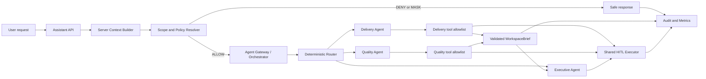
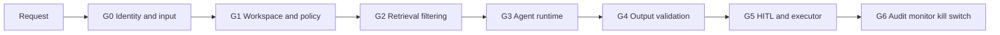
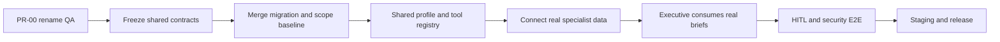

# Kế hoạch triển khai Multi-Agent theo Workspace — Kế hoạch chung của nhóm

> Tài liệu chia sẻ chính thức cho nhóm 4 người
>
> Mục tiêu demo: **Product Delivery Agent + Quality Assurance Agent + Executive Agent**
>
> Thời gian mục tiêu ban đầu: 7 ngày làm việc cho functional demo; phần cô lập runtime/deployment
> được triển khai tiếp theo theo các checkpoint R0–R7 tại mục 23–29, không ép vào cùng cửa sổ 7 ngày
>
> Nguyên tắc: workspace trước, agent sau; policy bằng code; mọi side effect qua HITL

> **Quyết định Product Delivery ngày 2026-08-27:** hợp nhất Task Intelligence và Work Intelligence
> thành một `Delivery Task Intelligence Agent` dùng nội bộ bởi Product Delivery Workspace Agent.
> Agent duy nhất này sở hữu task cụ thể, My Work và tổng hợp task nhóm/workspace. Router chỉ cấp thêm
> checkpoint/portfolio tools cho các intent tổng hợp; không tạo một agent riêng cho từng tool.
> `work_intelligence` chỉ được chuẩn hóa khi đọc workflow lịch sử và không còn là một runtime agent,
> feature flag, child run hay lựa chọn mới trên UI.

> Kiến trúc, data boundary, router, trách nhiệm Workspace Agent và luồng policy/HITL được định nghĩa canonical tại `docs/architecture/ARCHITECTURE.md`. Tài liệu này quản lý phạm vi, dependency, phân công và release gates. Quyết định cô lập runtime mới tại mục 23 là phần mở rộng bắt buộc của kiến trúc production và được đồng bộ vào `docs/architecture/ARCHITECTURE.md` v1.1.

> Company Root single-company, quyền Platform Admin, lead, Executive Workspace, membership và lifecycle được định nghĩa tại `docs/product/ENTERPRISE_WORKSPACE_FOUNDATION.md`. Tài liệu nền móng này được ưu tiên khi phần cũ còn giả định multi-tenant.

## 1. Tóm tắt quyết định

Ứng dụng đại diện cho một công ty với `Company Root` nội bộ cố định, bên trong có các Workspace nghiệp vụ và một Executive Workspace:

```text
Orbit Demo Company
├── Product Delivery Workspace
│   └── Product Delivery Agent
├── Quality Assurance Workspace
│   └── Quality Assurance Agent
└── Executive scope
    └── Executive Agent
```

Hai phòng ban được chọn vì có quan hệ trực tiếp nhưng ít nghiệp vụ pháp lý, tài chính và dữ liệu nhạy cảm:

- Product Delivery quản lý tiến độ, milestone, task, deadline, blocker và dependency.
- Quality Assurance quản lý test progress, bug, severity, regression và release readiness.
- Executive tổng hợp tiến độ và chất lượng để đưa ra risks, dependencies và decisions needed.

Không chọn HR, Finance, Legal, Procurement hoặc Sales cho MVP vì các miền này dễ kéo theo luật lao động, thuế, hợp đồng, doanh thu, dữ liệu cá nhân hoặc quy trình phê duyệt phức tạp.

Personal Agent hiện tại tiếp tục chạy như compatibility flow trong functional demo, nhưng không phải một
Workspace Agent và không được chia sẻ prompt, tool, checkpoint hoặc mutable runtime state với Workspace Agent.
Mục tiêu production là Personal Agent Service độc lập và một Workspace Agent runtime deployment độc lập cho
mỗi Workspace quan trọng; các runtime dùng chung contract/image, không sao chép source code.

> **Quy tắc lập lịch của nhóm:** PR-00 rename → contract freeze → migration/scope baseline là chuỗi bắt buộc tuần tự. Sau khi contract freeze, A/B/C/D được làm song song bằng interface và fixture; chỉ bước nối dữ liệu thật, Executive aggregation thật, HITL E2E và release mới phải chờ producer tương ứng hoàn thành.

## 2. Trạng thái repository và bước chuyển tiếp

### 2.1 Giai đoạn 0 — Foundation/Contract Baseline

Trạng thái current/target được theo dõi tại `docs/architecture/ARCHITECTURE.md`; backlog, ownership và release gate được theo dõi trực tiếp trong tài liệu này để tránh hai bảng tiến độ mâu thuẫn.

Đây là tên chính thức của phần nền bắt buộc trước các agent nghiệp vụ. Giai đoạn gồm tuần tự:

1. `PR-00 Rename QA`: chuẩn hóa `quality_assurance`.
2. `PR-01 Contracts & Flags`: khóa contract version 1.0 và feature flags.
3. `PR-02 Workspace Scope`: migration, API quản trị Agent Workspace, membership, resource mapping, consent-aware scope và denial tests.
4. `Router Skeleton`: registry profile/tool allowlist và deterministic router; chưa nối agent nghiệp vụ thật.

Foundation/contract baseline dưới đây đã có trên nhánh `develop`; từng Agent vẫn phải hoàn thành runtime, tool, brief pipeline, UI và test trước khi được đánh dấu Done.

| Hạng mục | Trạng thái | Việc còn lại |
|---|---|---|
| PR-00 Quality Assurance rename | Hoàn thành trong working tree | Review và merge baseline |
| Agent contracts, AgentState, feature flags | Contract v1.0 đã khóa trong working tree | Review consumer compatibility và merge |
| Agent Workspace models/migration/API | Baseline hoàn thành trên `develop` | Seed/demo data ở phase sau |
| Context Builder, Scope Resolver, Registry/Router | Baseline hoàn thành trong working tree | Nối runtime agent thật sau khi specialist profile tồn tại |
| Product Delivery Agent | Đã có vertical slice local: scoped Delivery runtime, LLM, dashboard, Lead/Member UI và test | Hoàn thiện citation/audit/E2E rồi dùng làm runtime đầu tiên được tách service |
| Quality Assurance Agent | Chưa triển khai | Owner C thực hiện vertical slice |
| Executive Agent | Chưa triển khai | Owner D thực hiện trên WorkspaceBrief mock trước |
| Platform Admin UI | Hoàn thành baseline | Tạo Workspace trong company cố định; gắn agent, chọn lead/member và suspend/activate |
| User Workspace UI | Hoàn thành baseline read-only | Chỉ hiển thị Workspace được Admin phân công |
| User UI nghiệp vụ theo Agent Workspace | Chưa triển khai | Mỗi agent owner làm UI của slice mình; A giữ shared shell |

PR-00 đã đổi đồng bộ `customer_operations` thành `quality_assurance` trong:

- `AgentProfile`, `AgentIntent` và feature flag.
- `AgentWorkspace` check constraint và migration chưa phát hành.
- Tests, `.env.example` và tài liệu.
- Không giữ alias cũ vì profile chưa được bật ở bất kỳ môi trường nào.

PR-00 và contract/scope/router baseline đã pass test cục bộ; vẫn phải review và merge trước khi B/C/D nối dữ liệu thật.

## 3. Thuật ngữ và biên dữ liệu

| Khái niệm | Ý nghĩa | Ví dụ |
|---|---|---|
| Personal Workspace | Dữ liệu cá nhân của một người | Lịch, reminder, memory cá nhân |
| Company Root | Biên dữ liệu nội bộ duy nhất của công ty; user không tạo/chọn | `company-root` |
| Workspace (`AgentWorkspace` trong schema) | Vùng nghiệp vụ do Admin tạo, có một supporting agent | Product Delivery, Quality Assurance, Executive |
| Agent Profile | Cấu hình prompt, tool, scope và output | `product_delivery`, `quality_assurance`, `executive` |
| WorkspaceBrief | Kết quả có cấu trúc của specialist agent | Delivery Brief, Quality Brief |

MVP dùng một PostgreSQL chung. Không tạo database vật lý riêng cho từng phòng ban. Dữ liệu được phân vùng logic bằng:

```text
organization_workspace_id
+ agent_workspace_id
+ actor/resource membership
+ consent
+ purpose/policy
```

## 4. Kiến trúc chung



Ba Workspace Agent dùng chung contract, policy protocol và runtime image; không sao chép source code hoặc tự
tạo contract riêng. Câu này không đồng nghĩa chúng phải chạy chung một process. Functional demo có thể chạy
trong modular monolith, còn production target tách fault domain bằng deployment/runtime độc lập:

```text
agent = profile + prompt version + allowed scope + tool allowlist
      + output schema + policy rules + eval suite + runtime budget
```

```text
shared contract/image != shared process/state/failure domain
```

### 4.1 Contract chung phải khóa trước

Cả nhóm phải dùng duy nhất các contract sau:

- `AgentContext`: identity, organization, agent workspace, role và runtime facts do server tạo.
- `PolicyDecision`: `ALLOW | DENY | MASK | REQUIRE_APPROVAL`.
- `SourceReference`: resource ID, loại nguồn và timestamp; không chứa secret/token.
- `ToolResult`: status, structured payload, sources, partial/error metadata.
- `ActionProposal`: actor, action, payload hash, expiry và idempotency key.
- `WorkspaceBrief`: envelope chung cho Delivery/Quality.
- `ExecutiveBrief`: facts, risks, dependencies, decisions, recommendations và data gaps.

Không thành viên nào tự tạo phiên bản contract riêng trong agent mình.

### 4.2 Giao tiếp giữa agent

- Agent không chat tự do với nhau và không truyền system prompt/token/toàn bộ state.
- Delivery và Quality tạo `WorkspaceBrief` có schema version, nguồn, thời điểm tạo và expiry.
- Executive chỉ đọc brief/aggregate đã policy-filter qua Orchestrator.
- Brief thiếu hoặc hết hạn tạo `data_gaps`; Executive không tự đọc raw chat để bù.
- Mỗi handoff giữ cùng `trace_id`, caller/callee profile, purpose và policy decision.
- Agent cấp cao không kế thừa quyền dữ liệu thô của agent cấp thấp.

## 5. Phân quyền

### 5.1 Admin và business entitlement

- `platform_admin` tạo Workspace trong Company Root cố định, gắn agent profile, bổ nhiệm lead và phân member; không tự nhận business membership.
- Ứng dụng không có workflow tạo/chuyển công ty; owner/lead không tạo hoặc cấu hình Workspace.
- Mỗi Agent Workspace active có đúng một active `lead`; đổi lead sẽ hạ lead cũ thành `member`.
- Chọn lead/member trong Admin control plane là quyết định explicit-enroll Company Membership nếu cần.
- Admin không tự động có quyền đọc dữ liệu nghiệp vụ.
- Người dùng agent phải có active membership trong đúng Agent Workspace.
- Executive cần entitlement aggregate riêng.
- `platform_admin` được quản lý metadata Workspace nhưng support access vào raw business data vẫn phải có grant và thời hạn.
- Không xây Admin Agent.

### 5.2 Ma trận quyền demo

| Principal | Agent được dùng | Scope | Không được mặc định |
|---|---|---|---|
| Delivery member/lead | Delivery Agent | Resource được phép trong Delivery | QA, Executive aggregate |
| QA member/lead | Quality Agent | Resource được phép trong QA | Delivery, Executive aggregate |
| Executive | Executive Agent | Validated briefs của hai workspace | Raw chat, memory/calendar thành viên |
| Workspace admin | Cấu hình/capability | Metadata và audit phù hợp | Dữ liệu nghiệp vụ nếu thiếu entitlement |
| Platform admin | System operations | Health/config | Tenant data nếu thiếu support grant |

Quyền hiệu lực tại mỗi tool call:

```text
actor entitlement
∩ agent profile capability
∩ organization workspace
∩ agent workspace membership
∩ requested resource scope
∩ consent
∩ purpose/data classification
∩ approval nếu có side effect
```

### 5.3 Guardrail Framework bắt buộc

Guardrail không chỉ là câu lệnh trong system prompt. Hệ thống phải enforce theo nhiều lớp, fail closed và có test độc lập cho từng lớp:



| Lớp | Enforce bằng code | Nếu không đạt | Test bắt buộc |
|---|---|---|---|
| G0 — Identity/input | JWT actor, server-built context, strict schema, reject extra auth fields | `401/422`, không gọi model | Spoof role/profile/allowlist |
| G1 — Workspace/policy | Organization membership, Agent Workspace membership, profile/scope/consent | `DENY/MASK`, không gọi retrieval/tool | Cross-workspace, revoked membership, admin without entitlement |
| G2 — Retrieval | Query bind organization + Agent Workspace + allowed resource IDs | Trả empty/partial; không nới scope | Guessed ID, private chat, cache isolation |
| G3 — Runtime | Prompt version, tool allowlist, step/tool/token budget, injection handling | Chặn tool hoặc safe response | Tool escalation, prompt injection, budget exhaustion |
| G4 — Output | Pydantic schema, source validation, freshness, redaction, fact/inference separation | Retry có giới hạn hoặc partial/error | Missing source, fabricated ID, stale brief, sensitive field |
| G5 — HITL | Proposal, actor binding, payload hash, expiry, idempotency | Không có side effect | Confirm/reject/edit/expired/double-click/retry |
| G6 — Operations | Sanitized audit, metrics, alert, per-profile flag và master kill switch | Tắt profile/toàn hệ thống | Audit leakage scan, flag-off smoke, incident drill |

#### G0 — Identity và input boundary

- `user_id`, business role, profile, allowed workspace/resource và policy decision chỉ do server tạo.
- Client chỉ gửi message, requested scope và target workspace; requested scope là yêu cầu, không phải quyền.
- Không đưa JWT, OAuth token, secret, raw audit log hoặc permission SQL vào model context.
- Context đã tạo là immutable; resume phải bind đúng actor/thread.

#### G1 — Scope, consent và data classification

- Authorization chạy trước retrieval và trước model/tool.
- Tool kiểm tra lại scope tại boundary; không tin `agent_workspace_id` do model truyền.
- Revoke membership/consent phải có hiệu lực ở request kế tiếp và invalidate cache/brief không còn hợp lệ.
- Executive mặc định chỉ có aggregate scope, không có raw specialist scope.
- Dữ liệu được phân loại tối thiểu:

| Classification | Ví dụ | Cách xử lý |
|---|---|---|
| Public workspace | Milestone/status đã công bố | Cho phép trong đúng workspace |
| Internal | Group chat, task, test result | Membership + consent + purpose |
| Restricted | Private chat, personal memory/calendar | Không vào workspace brief mặc định |
| Secret | Token, credentials, system prompt | Không đưa vào model/log/output |

#### G2 — Retrieval và memory

- Query phải chứa organization và Agent Workspace predicate, không lọc sau khi đã lấy toàn bộ dữ liệu.
- Chỉ trả field tối thiểu cần cho intent; pagination/time window có giới hạn.
- Source ID phải đến từ kết quả retrieval được phép, model không được tự tạo ID.
- Cache/memory key chứa actor, workspace, purpose và consent hash; không dùng cache chung xuyên Workspace.

#### G3 — Agent runtime

- Mỗi profile chỉ thấy tool allowlist của mình; không đăng ký tool quản trị hoặc direct DB query.
- Nội dung chat, memory và tool output đều là dữ liệu không tin cậy; chỉ thị nằm trong đó không thay đổi policy.
- Có `tool_budget`, `token_budget`, max steps và timeout; hết budget trả partial/data gaps.
- LLM chỉ phân loại intent và tổng hợp trong scope; router/policy không giao cho LLM quyết định.

#### G4 — Output và WorkspaceBrief

- Output phải validate đúng schema; fact quan trọng phải có source.
- Không có source thì ghi inference/data gap, không biến suy đoán thành fact.
- `WorkspaceBrief` bắt buộc có schema version, generated time, expiry và source resource IDs.
- Redact field không cần thiết trước khi lưu brief/audit; Executive không nhận raw message trong payload.
- Quality Agent không tự thay đổi bug severity/status; Delivery Agent không tự gán owner/deadline khi mơ hồ.

#### G5 — HITL và side effect

- Read-only tool không cần approval; create/update/delete/notify/assign luôn tạo proposal.
- Proposal hiển thị actor, target, payload, thời điểm và tác động trước confirm.
- Approval bind actor + action + payload hash + expiry; sửa payload làm approval cũ hết hiệu lực.
- Executor dùng idempotency key và không báo thành công cho tới khi tool trả success.
- Không tự retry side effect không idempotent.

#### G6 — Audit, monitoring và kill switch

- Audit lưu trace/profile/tool/policy reason/status/latency/token, không lưu raw private content hoặc token.
- Alert khi denial tăng bất thường, tool lỗi, brief stale, latency/cost vượt ngưỡng hoặc có output validation failure.
- Có flag cho từng profile và `MULTI_AGENT_ENABLED` làm master kill switch.
- Khi nghi ngờ data leak: tắt master flag trước, bảo toàn sanitized evidence và điều tra trước khi bật lại.

### 5.4 Guardrail ownership và sign-off

| Guardrail | Implement owner | Reviewer/sign-off |
|---|---|---|
| Identity/context/scope/tool policy | A | B hoặc C + D |
| Delivery domain/output guardrail | B | A + C |
| Quality/readiness/output guardrail | C | A + B |
| Executive aggregate/no-raw guardrail | D | A + B + C |
| HITL/audit/kill switch | A | D |
| Frozen security/E2E suite | D | Cả nhóm |

Không agent nào được bật feature flag nếu guardrail của profile đó chưa có happy, denial, injection, ambiguity, stale-data và tool-error evidence.

## 6. Phạm vi từng agent

### 6.1 Product Delivery Agent

**Mục tiêu**

- Tổng hợp milestone, overdue, due soon, blocked, unassigned và dependency.
- Chuẩn bị stand-up/weekly/release brief có owner, deadline và source.
- Phát hiện quyết định còn thiếu owner hoặc deadline.

**Input được phép**

- Group conversations đã gắn Delivery workspace và bật AI consent.
- Task/work item đã gắn Delivery workspace.
- Calendar của actor; shared calendar chỉ khi có entitlement riêng.
- Directory tối thiểu để resolve owner.

**Tool allowlist mục tiêu ban đầu**

Registry đang chạy hiện chỉ có `get_quality_work_items` và `build_quality_brief`; các tool còn lại dưới đây là
target capability, không phải implementation hiện có.

- `get_delivery_tasks`
- `search_delivery_messages`
- `get_delivery_milestones`
- `get_delivery_people`
- `build_delivery_brief`
- `propose_delivery_reminder`
- `propose_delivery_meeting`

**Output chính**

```json
{
  "headline": "string",
  "milestones": [],
  "blocked_items": [],
  "dependencies": [],
  "decisions_needed": [],
  "data_gaps": [],
  "source_ids": [],
  "generated_at": "ISO"
}
```

**Guardrail**

- Không coi số message là năng suất.
- Không đọc private chat hoặc QA workspace.
- Không tự giao việc, gửi reminder hoặc tạo meeting trước HITL.
- Owner/date mơ hồ phải trả `needs_clarification`.

### 6.2 Quality Assurance Agent

> Kế hoạch nâng cấp thực thi và inventory tool/harness canonical: xem
> [Quality Assurance Agent Workspace — Comprehensive Upgrade Plan](QUALITY_AGENT_WORKSPACE_COMPREHENSIVE_UPGRADE_PLAN.md).

**Mục tiêu**

- Tổng hợp test progress, failed/blocked tests, bug severity và regression status.
- Xác định `READY | AT_RISK | NOT_READY` cho release dựa trên facts có nguồn.
- Chuẩn bị quality/release-readiness brief cho Delivery và Executive.

**Input được phép**

- QA conversations đã gắn workspace và bật AI consent.
- Bug, test case và release check được biểu diễn bằng task/work-item metadata.
- Release/milestone reference do Delivery chia sẻ có cấu trúc.
- Calendar của actor; shared QA calendar khi có entitlement riêng.

**Tool allowlist**

- `get_quality_work_items`
- `search_quality_messages`
- `get_release_test_status`
- `get_quality_people`
- `build_quality_brief`
- `propose_quality_reminder`
- `propose_quality_meeting`

**Metadata MVP, không xây test-management system riêng**

```json
{
  "work_item_type": "bug|test_case|release_check",
  "severity": "low|medium|high|critical",
  "quality_status": "open|testing|passed|failed|blocked"
}
```

**Output chính**

```json
{
  "headline": "string",
  "release_readiness": "READY|AT_RISK|NOT_READY",
  "test_progress": {},
  "critical_defects": [],
  "blocked_tests": [],
  "quality_risks": [],
  "data_gaps": [],
  "source_ids": [],
  "generated_at": "ISO"
}
```

**Guardrail**

- Không tuyên bố release ready nếu thiếu release check bắt buộc.
- Không hạ severity hoặc đóng bug nếu chưa có tool result xác nhận.
- Không đọc Delivery raw chat; dependency đi qua structured reference/brief.
- Reminder/meeting/change status đều cần policy và HITL phù hợp.

### 6.3 Executive Agent

**Mục tiêu**

- Tổng hợp delivery health và quality readiness.
- Đưa risk, cross-workspace dependency và decision needed lên đầu.
- Phân biệt facts, inference, recommendation và data gaps.

**Input được phép**

- Validated Delivery Brief và Quality Brief còn hiệu lực.
- Aggregate metrics được kiểm soát.
- Dữ liệu cá nhân của chính Executive nếu policy cho phép.

**Tool allowlist**

- `get_workspace_briefs`
- `get_cross_workspace_dependencies`
- `build_executive_brief`
- `get_my_calendar`
- `propose_executive_meeting`

**Output chính**

```json
{
  "headline": "string",
  "facts": [],
  "risks": [],
  "cross_workspace_dependencies": [],
  "decisions_needed": [],
  "recommendations": [],
  "data_gaps": [],
  "workspace_brief_ids": []
}
```

**Guardrail**

- Executive entitlement không phải super-admin.
- Không drill down sang raw message nếu thiếu entitlement độc lập.
- Không đánh giá con người từ message count/sentiment.
- Brief stale phải được đánh dấu, không được trình bày như dữ liệu hiện tại.

## 7. Mô hình dữ liệu MVP

### 7.1 Bảng mới

```text
agent_workspaces
- id
- organization_workspace_id
- key: product_delivery | quality_assurance
- name
- agent_profile
- status
- created_at / updated_at

agent_workspace_memberships
- id
- agent_workspace_id
- user_id
- business_role: member | lead | executive_viewer
- status
- created_at / updated_at

agent_workspace_conversations
- agent_workspace_id
- conversation_id
- classification: delivery | quality
- linked_by_user_id
- created_at

workspace_briefs
- id
- organization_workspace_id
- agent_workspace_id
- brief_type: delivery | quality
- period_start / period_end
- schema_version
- payload_json
- source_resource_ids
- generated_by_run_id
- generated_at / expires_at

agent_runs
- id / trace_id
- actor_user_id
- organization_workspace_id
- agent_workspace_id nullable
- agent_profile / intent / requested_scope
- policy_decision / policy_reason
- prompt_version / model
- status / latency_ms / token_usage
- created_at
```

### 7.2 Thay đổi dữ liệu hiện có

- `Task`: thêm `agent_workspace_id nullable`, `source_message_ids`, `confidence`, `needs_clarification`, metadata QA.
- Approval: actor, action, payload hash, expiry, status và idempotency key.
- Audit: `trace_id`, profile, Agent Workspace, policy reason; không log raw content.

### 7.3 Ràng buộc

- Agent Workspace chỉ thuộc Organization Workspace active.
- User phải là active organization member trước khi được thêm vào Agent Workspace.
- Unique `(organization_workspace_id, key)` và `(agent_workspace_id, user_id)`.
- Query luôn bind organization + Agent Workspace; không nhận scope chỉ từ model/client.
- Executive chỉ đọc brief thuộc entitlement.
- Cache key chứa organization, Agent Workspace, actor/purpose và consent hash.

## 8. Phân công nhóm 4 người

Thay `A/B/C/D` bằng tên thật trước khi chia sẻ chính thức.

| Thành viên | Vai trò | Sở hữu | Deliverable cuối |
|---|---|---|---|
| A | Platform/Integration Owner | Shared core, DB, policy, router, shared UI shell | Core an toàn, ba profile tích hợp được |
| B | Delivery Agent Owner | Delivery vertical slice end-to-end | Delivery Agent + brief + UI + eval |
| C | Quality Agent Owner | Quality vertical slice end-to-end | Quality Agent + brief + UI + eval |
| D | Executive/Release Owner | Executive slice, aggregate, E2E, release | Executive Agent + eval report + demo |

### 8.1 A — Platform/Integration Owner

**Phụ trách**

- PR-00 đổi `customer_operations` thành `quality_assurance`.
- `AgentContext`, `AgentState`, context builder và deterministic router.
- Agent Workspace model/API/membership/resource mapping.
- Scope Resolver, tool policy, consent binding và audit.
- Shared tool/profile registry, HITL protocol và feature flags.
- Workspace switcher/capability API/shared approval component.
- Integration branch, migration order và conflict resolution.

**Không phụ trách thay**

- Prompt/domain logic chi tiết của B/C/D.
- Dataset nghiệp vụ của từng agent.

**Done khi**

- Client không thể khai giả role/profile/allowlist.
- Cross-workspace tests fail closed.
- Ba agent đăng ký profile/tool mà không sửa graph riêng.

### 8.2 B — Product Delivery Agent Owner

**Phụ trách end-to-end**

- Delivery profile, prompt và output validator.
- Delivery scoped services/tools.
- Delivery Workspace Brief.
- Delivery page/cards/source/freshness/deny/error states.
- Delivery seed data và golden dataset.
- Unit, integration và security cases cho Delivery.

**File ưu tiên**

```text
src/agents/profiles/product_delivery.py
src/agents/tools/delivery_*.py
src/agents/schemas/delivery.py
src/services/delivery_workspace_service.py
Frontend/user/src/components/agents/delivery/*
tests/test_agents/test_product_delivery.py
```

**Done khi**

- Trả đúng milestone/blocker/dependency có source.
- Không thấy QA/private resource ngoài scope.
- Mọi action là proposal trước HITL.

### 8.3 C — Quality Assurance Agent Owner

**Phụ trách end-to-end**

- Quality profile, prompt và output validator.
- QA work-item metadata và scoped services/tools.
- Release readiness logic và Quality Workspace Brief.
- Quality page/cards/source/freshness/deny/error states.
- QA seed data và golden dataset.
- Unit, integration và security cases cho Quality.

**File ưu tiên**

```text
src/agents/profiles/quality_assurance.py
src/agents/tools/quality_*.py
src/agents/schemas/quality.py
src/services/quality_workspace_service.py
Frontend/user/src/components/agents/quality/*
tests/test_agents/test_quality_assurance.py
```

**Done khi**

- Readiness dựa trên test/bug facts có source.
- Critical bug làm release `NOT_READY` theo rule đã khóa.
- Không thấy Delivery raw data ngoài structured dependency.
- Mọi action là proposal trước HITL.

### 8.4 D — Executive/Release Owner

**Phụ trách end-to-end**

- Common WorkspaceBrief schema cùng A; D accountable cho consumer compatibility.
- Executive profile, aggregate tools và output validator.
- Stale/partial/missing brief handling.
- Cross-workspace dependency và Executive UI.
- E2E/security dataset, CI evidence, staging, runbook và demo.

**File ưu tiên**

```text
src/agents/profiles/executive.py
src/agents/tools/executive_*.py
src/agents/schemas/workspace_brief.py
src/agents/schemas/executive.py
src/services/workspace_brief_service.py
Frontend/user/src/components/agents/executive/*
tests/test_agents/test_executive.py
tests/test_agents/test_handoffs.py
```

**Done khi**

- Dùng được Delivery/Quality brief thật thay cho fixture mà không đổi contract.
- Không cần raw chat cho happy path.
- Full E2E, release report và demo evidence hoàn tất.

## 9. Ownership và review chéo

### 9.1 File chỉ có một owner

Các file sau A sở hữu; B/C/D không sửa trực tiếp nếu chưa thống nhất:

```text
src/agents/contracts.py
src/agents/state.py
src/agents/graph.py
src/agents/router.py
src/agents/context_builder.py
src/agents/tools/registry.py
src/db/models.py
src/config.py
src/db/migrations/versions/*
```

B/C/D thêm module riêng và đăng ký qua contract/registry. Nếu cần đổi shared contract, mở PR riêng và có A + ít nhất một consumer review.

### 9.2 Ma trận review

| PR | Reviewer bắt buộc |
|---|---|
| Core/policy/migration | B hoặc C kiểm tra usability; D kiểm tra gate |
| Delivery | A kiểm tra scope; C kiểm tra WorkspaceBrief compatibility |
| Quality | A kiểm tra scope; B kiểm tra WorkspaceBrief compatibility |
| Executive | A kiểm tra aggregate policy; B và C kiểm tra cách hiểu brief |
| UI capability/approval | A + owner agent tương ứng |
| E2E/release | D accountable; cả nhóm sign-off |

## 10. Ma trận công việc tuần tự và song song

> **Bắt buộc:** không hiểu “làm song song” là mỗi người tự xây một agent hoàn chỉnh rồi cuối tuần mới ghép. Song song chỉ bắt đầu sau contract freeze, dùng shared interfaces/fixtures và merge integration hằng ngày.

### 10.1 Chuỗi bắt buộc tuần tự



| Thứ tự | Công việc | Owner | Chỉ được hoàn thành khi | Việc bị chặn nếu chưa xong |
|---:|---|---|---|---|
| 1 | PR-00 đổi Customer Ops → QA | A | Lint/test pass, không còn identifier cũ trong runtime contract | Tất cả branch agent |
| 2 | Freeze shared contracts | A accountable, cả nhóm review | Context, ToolResult, Proposal, WorkspaceBrief có version | B/C/D integration |
| 3 | Migration + Scope Resolver baseline | A | Upgrade head và cross-workspace negative tests pass | Nối service/tool vào DB thật |
| 4 | Shared registry/router skeleton | A | Profile/tool allowlist enforce được | Đăng ký profile thật |
| 5 | Specialist brief producers | B và C | Brief validate schema, source/freshness đủ | Executive real integration |
| 6 | Executive real aggregation | D | Hai brief thật, stale/partial/deny pass | Cross-workspace E2E |
| 7 | HITL/security E2E | A + D | Leakage=0, HITL=100% | Bật staging flags |
| 8 | Staging/release | D | Toàn bộ release gates pass | Demo/release |

### 10.2 Bốn workstream được chạy song song

Sau khi bước 2 `Freeze shared contracts` hoàn tất, bốn luồng sau được bắt đầu cùng lúc:

| Workstream | Bắt đầu khi | Làm song song với | Dùng mock/fixture gì | Chưa được tích hợp thật cho tới khi |
|---|---|---|---|---|
| A — Core/API/Policy | Contract freeze | B, C, D | Không cần | Migration/scope tests xanh |
| B — Delivery Agent | Delivery schema/tool interface frozen | A, C, D | Mock AgentContext/scoped service | PR-02 resource mapping sẵn sàng |
| C — Quality Agent | QA schema/readiness rules frozen | A, B, D | Mock AgentContext/scoped service | PR-02 resource mapping sẵn sàng |
| D — Executive Agent | WorkspaceBrief/ExecutiveBrief frozen | A, B, C | Delivery/Quality brief fixtures | B và C có validated brief producer |

Trong mỗi specialist workstream, các phần sau có thể làm song song nội bộ nếu không cùng sửa shared file:

- Prompt/profile và output validator.
- Mocked read tools/service interface.
- UI shell với fixture data.
- Seed/golden dataset và evaluator.
- Error/empty/deny/stale states.

Các phần sau **không được tự làm riêng hoặc merge trước shared owner**:

- Migration và thay đổi `src/db/models.py`.
- `AgentContext`, `AgentState`, router và policy decision.
- Tool registry/HITL protocol/audit schema.
- Common WorkspaceBrief envelope.
- Feature flag semantics và capability API.

### 10.3 Dependency theo deliverable

| Deliverable | Producer | Consumer | Consumer có thể làm trước bằng mock? | Điều kiện thay mock bằng thật |
|---|---|---|:---:|---|
| AgentContext + policy result | A | B, C, D | Có | Context/security tests pass |
| Delivery Brief v1 | B | D | Có | Schema/source/freshness validation pass |
| Quality Brief v1 | C | D | Có | Readiness/source/freshness validation pass |
| Shared HITL proposal | A | B, C, D | Có | Actor/payload/expiry/idempotency tests pass |
| Executive Brief | D | UI/demo/eval | Có | Hai real briefs + aggregate policy pass |

### 10.4 Contract fixtures để không chờ nhau

D tạo hai fixture chuẩn trong ngày đầu:

```text
eval/fixtures/delivery_brief_v1.json
eval/fixtures/quality_brief_v1.json
```

- B/C phải tạo output validate đúng common envelope và domain payload trong fixture.
- D chỉ dùng field trong schema, không parse text tự do để suy ra facts.
- Fixture có `schema_version`, sources, generated time và expiry.
- Khi brief thật sẵn sàng, chạy contract test fixture-vs-producer trước khi thay mock.

### 10.5 Integration gate hằng ngày

Merge theo thứ tự cố định:

```text
migration/shared contracts
→ core policy/registry
→ Delivery và Quality producers
→ Executive consumer
→ UI
→ security/full regression
```

Một PR chỉ vào integration khi:

- Không sửa shared contract ngoài phạm vi đã review.
- Có test hẹp, negative test và evidence tương ứng.
- Feature flag vẫn off nếu vertical slice chưa đạt guardrail gate.
- Branch đã lấy integration mới nhất và không làm giảm test baseline.

### 10.6 Stop rules

- Contract thay đổi: dừng integration B/C/D, version contract và cập nhật fixtures trước khi tiếp tục.
- Migration/scope fail: B/C vẫn làm mock logic/UI/eval, nhưng không nối DB thật.
- Một specialist brief chưa đạt source/freshness: D tiếp tục fixture flow, không dùng output thật.
- Security leak hoặc HITL bypass: dừng mọi feature work, tắt flags và xử lý P0 trước.
- Full regression đỏ: không merge PR tiếp theo cho tới khi baseline xanh.

## 11. Chiến lược Git và merge

```text
integrate/multi-agent-demo
├── feat/agent-core              # A
├── feat/delivery-agent          # B
├── feat/quality-agent           # C
└── feat/executive-agent         # D
```

Quy tắc:

- Contract/migration baseline được merge trước khi tách nhánh dài hạn.
- Nhánh sống tối đa 1–2 ngày; pull/rebase integration mỗi sáng.
- PR nhỏ, một mục tiêu, có tests/evidence; không giữ “agent hoàn chỉnh” một tuần rồi mới merge.
- Feature flag giữ flow hiện tại không gãy.
- Thứ tự merge mỗi ngày: migration/core → specialist contracts → Delivery/Quality → Executive → tests.
- Không force-push nhánh người khác; không sửa migration đã phát hành lên staging/production.

Mẫu chuỗi PR của mỗi agent:

```text
profile/schema skeleton
→ read-only services/tools
→ output validation + WorkspaceBrief
→ negative/security tests
→ HITL proposals
→ UI states
→ E2E integration
```

## 12. Kế hoạch 7 ngày

### Ngày 1 — Rename, contract freeze và baseline

| Owner | Công việc | Deliverable |
|---|---|---|
| A | PR-00 rename; khóa context/policy/tool contracts; hoàn thiện flags | Contract baseline merged |
| B | Chốt Delivery schema/tool interfaces; 15 golden cases đầu | Delivery skeleton + fixture expectations |
| C | Chốt QA metadata/readiness rules; 15 golden cases đầu | Quality skeleton + fixture expectations |
| D | Chốt WorkspaceBrief/ExecutiveBrief; tạo hai brief fixtures; CI matrix | Mock Executive flow + baseline report |

Gate cuối ngày:

- Không còn `customer_operations` trong contract/migration mới.
- Client không quyết định role/allowlist.
- Current backend tests và frontend build pass.

### Ngày 2 — Core scope và hai specialist read flows

| Owner | Công việc | Deliverable |
|---|---|---|
| A | Agent Workspace API, membership, resource mapping, router skeleton | Scope thật + denial tests |
| B | Delivery read services/tools, prompt và validator | Delivery read-only vertical slice |
| C | Quality read services/tools, readiness rules và validator | Quality read-only vertical slice |
| D | Executive aggregate từ fixture; stale/missing handling | Executive mock vertical slice |

Gate cuối ngày:

- Delivery user không query được Quality và ngược lại.
- Executive fixture output có brief IDs/data gaps.
- Workspace admin thiếu entitlement bị từ chối.

### Ngày 3 — WorkspaceBrief và UI skeleton

| Owner | Công việc | Deliverable |
|---|---|---|
| A | Shared registry, policy at tool boundary, trace/audit | Profile/tool enforcement |
| B | Delivery Brief producer, sources/freshness, Delivery UI | Delivery brief thật |
| C | Quality Brief producer, sources/freshness, Quality UI | Quality brief thật |
| D | Thay fixture dần bằng brief thật; Executive UI shell | First integrated aggregate |

Gate cuối ngày:

- Hai brief validate cùng common envelope.
- Fact quan trọng có source.
- Executive không đọc raw resource.

### Ngày 4 — HITL và cross-workspace scenario

| Owner | Công việc | Deliverable |
|---|---|---|
| A | Approval binding, expiry/idempotency, capability API | Secure action executor |
| B | Delivery reminder/meeting proposal | Delivery HITL flow |
| C | Quality reminder/meeting proposal; critical-bug rule | Quality HITL flow |
| D | Cross-workspace dependency và Executive decision flow | Demo happy path đầy đủ |

Gate cuối ngày:

- Không side effect trước confirm.
- Sửa payload bắt buộc confirm lại.
- Critical bug làm release `NOT_READY`; Executive phản ánh đúng risk.

### Ngày 5 — Security, eval và edge cases

| Owner | Công việc | Deliverable |
|---|---|---|
| A | Injection guard, cache/revoke, audit redaction | Security hardening |
| B | Delivery ambiguity/error/deny cases, prompt tuning | Delivery eval đạt gate |
| C | Quality ambiguity/error/deny cases, prompt tuning | Quality eval đạt gate |
| D | Freeze dataset, full E2E/security evaluation | Release-gate report v1 |

Gate cuối ngày:

- Routing `>=95%`.
- Extraction precision `>=90%`, recall `>=80%`.
- Unauthorized leakage `=0`; HITL coverage `=100%`.

### Ngày 6 — Staging, performance và demo rehearsal

| Owner | Công việc | Deliverable |
|---|---|---|
| A | Migration/rollback rehearsal, performance và kill switch | Operational checklist |
| B | Delivery UI polish chỉ sau correctness; fix P0 | Delivery sign-off |
| C | Quality UI polish chỉ sau correctness; fix P0 | Quality sign-off |
| D | Deploy staging, smoke/E2E, cost/latency report, rehearsal | Demo candidate |

Gate cuối ngày:

- Backend/full migration/frontend builds pass.
- Staging chạy ba happy paths + denial + HITL.
- Prompt/model/schema/policy versions xuất hiện trong trace.

### Ngày 7 — Freeze, evidence và demo

| Owner | Công việc | Deliverable |
|---|---|---|
| A | Chỉ fix P0 core/policy; pin versions | Core release candidate |
| B | Chỉ fix P0 Delivery; chuẩn bị seeded account | Delivery demo ready |
| C | Chỉ fix P0 Quality; chuẩn bị seeded account | Quality demo ready |
| D | Full regression, backup evidence/video, release notes/runbook | Final report + demo |

Không thêm tính năng mới ngày 7.

## 13. Backlog/PR map

| PR | Owner | Phụ thuộc | Nội dung | Gate |
|---|---|---|---|---|
| PR-00 Rename QA | A | Không | Customer Ops → Quality Assurance | Full regression |
| PR-01 Contracts/flags | A | PR-00 | Context/state/flags strict | Flow cũ không đổi |
| PR-02 Workspace scope | A | PR-01 | Model/API/membership/policy | Cross-workspace leak=0 |
| PR-B1 Delivery read | B | PR-01 contract | Services/tools/profile | Read tests pass |
| PR-C1 Quality read | C | PR-01 contract | Metadata/tools/profile | Readiness tests pass |
| PR-D1 Executive mock | D | Brief contract | Aggregate fixtures | Partial/stale pass |
| PR-B2 Delivery brief/UI | B | PR-B1, PR-02 | Brief producer + UI | Source coverage=100% |
| PR-C2 Quality brief/UI | C | PR-C1, PR-02 | Brief producer + UI | Source coverage=100% |
| PR-D2 Executive real | D | PR-B2, PR-C2 | Real brief consumer + UI | No raw data needed |
| PR-06 HITL/actions | A+B+C | Specialist read | Proposals/executor/UI | HITL=100% |
| PR-07 Eval/release | D | Tất cả P0 | E2E/security/staging | Release gates pass |

## 14. Dữ liệu seed và tài khoản demo

### 14.1 Tài khoản

| Tài khoản | Entitlement | Mục đích |
|---|---|---|
| `executive.demo` | Aggregate briefs của Delivery + QA | Executive happy/denial flow |
| `delivery.lead` | Lead Delivery | Delivery brief + HITL |
| `delivery.member` | Member Delivery | Personal/team boundary |
| `quality.lead` | Lead QA | Quality brief + HITL |
| `quality.member` | Member QA | QA task boundary |
| `workspace.admin` | Admin, không business entitlement | Chứng minh admin không tự đọc dữ liệu |

### 14.2 Delivery dataset

- 2 project/group conversations đã consent.
- 10–15 tasks: 2 overdue, 2 due soon, 2 blocked, 1 unassigned.
- 2 milestones và 1 release target.
- 1 dependency sang QA và 1 decision cần Executive.
- 2 input mơ hồ để kiểm tra clarification.

### 14.3 Quality dataset

- 2 QA/release conversations đã consent.
- 12–16 work items gồm bug, test case và release check.
- Ít nhất 1 `critical` bug open, 2 failed tests, 1 blocked regression và các passed checks.
- 1 dependency trỏ đúng release target của Delivery.
- 2 input mơ hồ/thiếu source để kiểm tra data gaps.

Seed script phải idempotent và chỉ dùng dữ liệu synthetic/de-identified.

### 14.4 Golden dataset multi-agent v1

- File chuẩn: `eval/datasets/multi_agent_workspace_v1.jsonl`.
- Quy mô cố định: **150 case**, gồm 10 nhóm × 15 case: Delivery summary, Quality readiness, Executive aggregate, routing, workspace permission, prompt injection, HITL, stale/partial brief, revoke membership/consent và cross-workspace dependency.
- `eval/datasets/user_agent_acceptance_v1.json` (17 case) tiếp tục là regression baseline của luồng user-agent cũ; không sửa hoặc trộn hai bộ dữ liệu.
- Sinh lại bằng `python scripts/generate_multi_agent_dataset.py --write`; CI kiểm tra tính tái lập bằng `--check` và kiểm tra invariant bằng `python scripts/validate_multi_agent_dataset.py`.
- Bộ v1 hiện kiểm tra contract/policy bằng expected output có cấu trúc. Chỉ nối vào live evaluator sau khi ba profile và scoped tools tồn tại; không dùng kết quả structural để tuyên bố chất lượng LLM production.
- Mô tả taxonomy, schema và quy tắc versioning nằm tại `docs/testing/MULTI_AGENT_TEST_DATASET.md`.

## 15. Kịch bản demo 8–10 phút

1. **Delivery — 2 phút:** “Release tuần này đang bị chặn ở đâu?” → milestone, blocker, dependency và source.
2. **Quality — 2 phút:** “Release đã đủ điều kiện chưa?” → `NOT_READY` do critical bug/test failure có source.
3. **Cross-workspace — 1 phút:** Quality Brief tham chiếu release/milestone của Delivery qua structured ID.
4. **Executive — 2 phút:** “Tình hình release và tôi cần quyết định gì?” → tổng hợp hai briefs, risk và decision.
5. **HITL — 1 phút:** đề xuất meeting xử lý bug; chưa tạo trước confirm.
6. **Security — 1 phút:** Executive yêu cầu raw QA chat hoặc admin mở Delivery data → DENY/MASK có reason.

Demo đạt khi:

- Route đúng ba agent và đúng scope.
- Facts có source/brief IDs.
- Critical bug nhất quán từ QA đến Executive.
- Không side effect trước confirmation.
- Denial được trình diễn như tính năng cốt lõi.

## 16. Chiến lược kiểm thử

Mỗi PR chạy test hẹp trước, sau đó regression liên quan:

```powershell
ruff check src/ tests/
python scripts/generate_multi_agent_dataset.py --check
python scripts/validate_multi_agent_dataset.py
pytest tests/test_multi_agent_dataset.py -v --tb=short
pytest tests/test_agents/ -v --tb=short
pytest tests/test_agent_workspaces.py -v --tb=short
pytest tests/test_authorization.py tests/test_ai_permissions.py tests/test_workspaces.py -v --tb=short
pytest tests/ -v --tb=short
alembic upgrade head
npm --prefix Frontend run build
git diff --check
```

### 16.1 Ma trận security/logic

| Trường hợp | Kết quả |
|---|---|
| Delivery member gọi Delivery | ALLOW đúng resource |
| Delivery member gọi Quality | DENY trước model/tool |
| QA lead đoán Delivery resource ID | DENY tại policy và tool boundary |
| Executive đọc hai briefs | ALLOW aggregate |
| Executive đọc raw private chat | DENY/MASK mặc định |
| Admin thiếu business entitlement | Không đọc nghiệp vụ |
| Revoke membership/consent | Request kế tiếp không truy xuất; cache invalidated |
| Prompt injection bỏ qua quyền | Không đổi policy/tool allowlist |
| Brief hết hạn | Stale/data gap; không bịa |
| Critical bug open | Release `NOT_READY` |
| Action/reminder/meeting | Proposal + HITL + idempotency |

### 16.2 Release gates

- Routing accuracy `>=95%`.
- Task/work-item extraction precision `>=90%`, recall `>=80%`.
- Source coverage cho fact quan trọng `=100%`.
- Unauthorized leakage `=0`.
- Side effect qua HITL `=100%`.
- Backend/full migration/frontend build/E2E pass.
- Audit scan không có raw message, PII không cần thiết hoặc token.

## 17. Nhịp làm việc hằng ngày

- 08:45: sync 15 phút về dependency, contract và blocker.
- 09:00: pull integration, chạy smoke tests, bắt đầu workstream.
- 13:30: contract check; D cập nhật failure/eval report.
- Trước 16:00: mở PR nhỏ có test và evidence.
- 16:00–17:00: merge theo thứ tự core → specialists → executive → tests.
- 17:00: deploy staging và demo nội bộ 15–20 phút.
- Cuối ngày: cập nhật risk/cut list và trạng thái PR trong tài liệu/board.

## 18. Definition of Ready và Definition of Done

### 18.1 Ready

Task chỉ bắt đầu khi có:

- Owner và reviewer.
- Input/output contract.
- Scope/authorization rule.
- Expected UI states.
- Happy, denial, ambiguity và tool-error tests.
- Feature flag/rollback behavior nếu thay đổi flow.

### 18.2 Done cho một PR

- Code + migration/compatibility phù hợp.
- Policy/HITL được enforce bằng code, không chỉ prompt.
- Tests hẹp và regression liên quan pass.
- Audit/metrics không chứa raw sensitive content.
- UI có loading/empty/partial/error/deny/approval states nếu áp dụng.
- Prompt/model/schema/policy version được trace.
- Docs và fixtures cập nhật.

### 18.3 Done cho dự án

- Company Root chứa các Department Workspace cô lập và một Executive Workspace chỉ đọc validated aggregate.
- Shared contracts/control plane route được Delivery, Quality và Executive profile runtimes; không yêu cầu chúng
  chạy chung process.
- Delivery/Quality chỉ đọc resource đúng workspace.
- Executive chỉ đọc validated briefs mặc định.
- Admin role tách khỏi business entitlement.
- Handoff có schema, source, freshness, trace và audit.
- Tool allowlist enforce tại runtime và tool boundary.
- Mọi side effect có HITL, payload binding, expiry và idempotency.
- Personal ↔ Workspace và dedicated Workspace ↔ Workspace fault-isolation gates tại mục 28 pass.
- Release gates đạt; seed/demo/runbook/kill switch sẵn sàng.

## 19. Vận hành, rollback và xử lý sự cố

### 19.1 Feature flags

```text
MULTI_AGENT_ENABLED
PRODUCT_DELIVERY_AGENT_ENABLED
QUALITY_ASSURANCE_AGENT_ENABLED
EXECUTIVE_AGENT_ENABLED
```

- Mặc định false.
- Bật theo organization demo trước.
- Có thể tắt từng specialist hoặc toàn bộ hệ thống.

### 19.2 Rollback

- Migration giai đoạn đầu chỉ thêm bảng/cột nullable; không phá flow cũ.
- Rollback hành vi bằng feature flags.
- Migration production sửa forward; không xóa dữ liệu để rollback.
- Khi specialist bị tắt, trả safe unavailable response. Personal Agent vẫn hoạt động độc lập nhưng không xử lý thay
  workspace intent để né policy hoặc che lỗi runtime.

### 19.3 Sự cố

| Sự cố | Hành động |
|---|---|
| Sai routing | Tắt profile tương ứng; kiểm tra deterministic rules |
| Dấu hiệu data leak | Tắt `MULTI_AGENT_ENABLED`; giữ sanitized audit metadata |
| Tool side effect lỗi | Dừng executor; không retry action không idempotent |
| Brief stale/thiếu | Executive trả partial + data gaps |
| Model/provider lỗi | Fallback model hoặc deterministic fixture chỉ cho rehearsal |
| Cost/latency cao | Giảm context/tool budget, cache brief và dùng model nhỏ hơn |

## 20. Cut order khi trễ

Cắt theo thứ tự sau, không cắt authorization/HITL/test:

1. Biểu đồ nâng cao → giữ text brief và status cards.
2. Semantic/vector search → giữ keyword/time-window search hiện có.
3. Shared calendar nâng cao → giữ proposal local/HITL.
4. Automated brief refresh → cho phép refresh thủ công có freshness indicator.
5. Cross-workspace dependency tổng quát → giữ đúng một release scenario.
6. Prompt tối ưu sâu → giữ schema validation và deterministic rules.

Không được cắt:

- Workspace/resource authorization.
- Consent.
- Tool allowlist.
- HITL.
- Source grounding.
- Audit redaction.
- Negative/security regression tests.

## 21. Checklist trước khi demo/release

- [x] PR-00 đổi hoàn toàn Customer Operations thành Quality Assurance trong working tree.
- [x] Shared contract đã freeze/version 1.0; domain fixtures tiếp tục do B/C/D bổ sung.
- [ ] Sáu demo accounts có đúng membership/entitlement.
- [ ] Delivery, Quality và Executive happy paths chạy trên staging.
- [ ] Cross-workspace critical bug scenario nhất quán.
- [ ] Raw-data denial và admin-without-entitlement denial pass.
- [ ] HITL confirm/edit/reject/double-click cases pass.
- [ ] Full backend tests, migration và hai frontend builds pass.
- [ ] Eval report ghi commit, dataset, prompt, model, schema và policy versions.
- [ ] Logs/audit không có raw message/PII/token.
- [ ] Feature flags và kill switch đã rehearsal.
- [ ] Seed script idempotent và dữ liệu hoàn toàn synthetic.
- [ ] Có release notes, runbook và bằng chứng demo dự phòng.

## 22. Việc nhóm làm ngay sau khi nhận kế hoạch

1. Điền tên thật vào A/B/C/D và xác nhận reviewer.
2. Cả nhóm review và merge Foundation/Contract Baseline (`PR-00`, `PR-01`, `PR-02`, router skeleton).
3. B/C/D xác nhận contract v1.0 dùng được trước khi mở vertical slice.
4. D tạo hai WorkspaceBrief fixtures.
5. Tách bốn workstream branch ở mục 11.
6. B/C/D bắt đầu skeleton song song; A giữ ownership shared core và review scope/tool boundary.
7. Cuối ngày chạy full regression và demo nội bộ theo gate ngày 1.

## 23. Quyết định tiến hóa kiến trúc runtime — ADR-MA-10

> **Ngày review:** 2026-08-24
>
> **Trạng thái:** Accepted cho hướng production; triển khai tuần tự sau khi giữ xanh functional demo
>
> **Mục tiêu:** Personal Agent lỗi không làm Workspace Agent lỗi; Workspace A lỗi hoặc quá tải không làm
> Workspace B lỗi; không sao chép code để đạt cô lập.

### 23.1 Kết quả audit hiện trạng

Repository hiện là **modular monolith**, chưa phải microservice/cell architecture:

- `src/main.py` import Personal routes, Delivery routes và khởi tạo Personal LangGraph checkpointer trong cùng
  FastAPI lifespan.
- `Dockerfile` chạy một `uvicorn src.main:app`.
- `docker-compose.yml` chỉ có một `backend` và một `postgres`.
- `render.yaml` chỉ deploy một web service `orbit-backend`.
- Personal Agent và Product Delivery Agent đã có graph/tool boundary riêng; Product Delivery còn có exception
  boundary trả `partial` khi LLM runtime lỗi.
- PostgreSQL, process, auth, cấu hình LLM và provider quota vẫn là shared failure domain.

Kết luận audit:

| Lớp cô lập | Hiện tại | Mục tiêu production |
|---|---|---|
| Prompt/tool/state theo profile | Đã có phần lớn | Bắt buộc giữ |
| Authorization theo Agent Workspace | Đã có | Bắt buộc giữ và revalidate |
| Process/container Personal ↔ Workspace | Chưa có | Tách độc lập |
| Process/container Workspace A ↔ B | Chưa có | Dedicated runtime cho Workspace quan trọng |
| CPU/RAM/concurrency/token budget theo Workspace | Chưa có | Bắt buộc trước production |
| Health/version/rollback theo Workspace | Chưa có | Bắt buộc trước production |
| Queue/circuit breaker/fair scheduling | Chưa có | R6; không chặn R2 functional extraction |

### 23.2 Quyết định

Chọn mô hình **Hybrid Bridge / Workspace-isolated runtime**:

```text
Shared Control Plane
├── Core API / Agent Gateway
├── Auth, membership, policy
├── Workspace Registry
├── Groups, tasks, messages, consent
└── Audit / observability metadata

Independent Agent Data Plane
├── Personal Agent Service                  # multi-user, state theo user/thread
├── Product Delivery Agent Runtime          # cố định agent_workspace_id=delivery
├── Quality Assurance Agent Runtime         # cố định agent_workspace_id=quality
└── Executive Agent Runtime                 # aggregate brief, không raw specialist data
```

Quy tắc triển khai:

1. Một runtime image chuẩn có thể được dùng cho nhiều Workspace deployment; không copy repository.
2. Mỗi dedicated Workspace runtime là process/container, quota, health, version và circuit breaker độc lập.
3. Runtime được bind cứng với `organization_id + agent_workspace_id + agent_profile`; request lệch target bị từ chối.
4. Core API là nguồn sự thật cho identity, membership, resource mapping, consent và policy.
5. Agent không truyền system prompt, checkpoint, token hoặc toàn bộ state cho nhau.
6. Personal ↔ Workspace và specialist ↔ Executive chỉ giao tiếp qua typed handoff/brief đã validate.
7. MVP tiếp tục dùng PostgreSQL chung; cô lập compute trước, storage isolation nâng cấp theo rủi ro thực tế.

### 23.3 Vì sao không tách full silo ngay

Không tạo database, Redis cluster, Core API và source tree riêng cho từng phòng ban ngay lập tức. Việc đó làm tăng
chi phí vận hành trước khi runtime contract, observability và automated provisioning ổn định. Thứ tự ưu tiên là:

```text
fault boundary trong code
→ tách Product Delivery runtime
→ Gateway/Registry
→ tách Personal runtime
→ per-workspace quota/circuit/queue
→ cell hoặc scale-to-zero khi số Workspace tăng
```

### 23.4 Deployment mode khi số Workspace tăng

| Mode | Dùng khi | Isolation | Ghi chú |
|---|---|---|---|
| `dedicated` | Workspace quan trọng, ít Workspace, SLA cao | Process/container riêng | Mode đầu tiên cho Delivery |
| `scale_to_zero` | Nhiều Workspace ít sử dụng | Như dedicated khi active | Có cold-start; cần automated provisioning |
| `cell` | Nhiều Workspace thông thường | Cô lập theo cell + bulkhead theo Workspace | Không dùng trước khi per-workspace quota test pass |

Không chuyển một Workspace từ `dedicated` sang `cell` chỉ vì chi phí nếu chưa có load/fault evidence chứng minh
SLO vẫn đạt.

## 24. Biên trách nhiệm giữa Core, Personal và Workspace runtime

### 24.1 Core API / Agent Gateway

Core chịu trách nhiệm:

- xác thực JWT và tạo `actor_user_id`;
- resolve Company Root, Agent Workspace, role và source bindings;
- kiểm tra consent/purpose trước retrieval;
- tạo `AgentContext` hoặc authorized snapshot đã sanitize;
- lookup runtime endpoint/version/status từ Workspace Runtime Registry;
- ký internal invocation, đặt deadline và `trace_id`;
- lưu sanitized audit, run status và usage metadata;
- fail closed khi runtime không đúng target, unhealthy hoặc version không được phép.

Core không chịu trách nhiệm:

- thực thi profile graph sau khi runtime đã được tách;
- giữ mutable LangGraph state của Workspace runtime;
- relay system prompt hoặc raw checkpoint giữa Agent;
- fallback từ Workspace Agent sang Personal Agent để né lỗi quyền.

### 24.2 Personal Agent Service

Personal Agent là một service đa user, không tạo container cho từng người. Nó sở hữu:

- Personal graph, planner, guardrail và tool binding;
- server-side thread/checkpointer;
- Personal Memory retrieval;
- Calendar/Reminder HITL của actor;
- state key `personal:{user_id}:{thread_id}`;
- quota/concurrency theo user và service.

Personal Agent không đọc toàn bộ tiến độ phòng ban. Nếu nhận workspace intent, nó tạo handoff candidate hoặc hướng
người dùng mở đúng Workspace Agent; Core phải kiểm tra quyền trước khi chuyển.

### 24.3 Workspace Agent runtime

Mỗi runtime deployment sở hữu:

- profile prompt/graph/output guardrail;
- profile tool allowlist;
- runtime timeout, recursion/tool/token budget;
- health/readiness và version;
- workspace-scoped thread state nếu profile hỗ trợ chat nhiều lượt;
- metrics không chứa raw private content.

Runtime không tự quyết định role/scope từ prompt. Với Product Delivery giai đoạn R2, Core chuẩn bị authorized,
source-backed snapshot; runtime chỉ gọi tool snapshot cục bộ và tổng hợp. Đây là biên tách an toàn nhất từ code hiện
tại vì không cần cấp database credential rộng cho runtime.

### 24.4 Personal ↔ Workspace handoff

Handoff tối thiểu:

```json
{
  "handoff_id": "uuid",
  "trace_id": "uuid",
  "actor_user_id": "server-resolved",
  "organization_id": "company-root-id",
  "source_agent": "personal",
  "target_agent_workspace_id": "product-delivery-id",
  "target_profile": "product_delivery",
  "intent": "delivery_brief",
  "message": "user text",
  "allowed_resource_ids": ["server-resolved-id"],
  "consent_scope_hash": "hash",
  "issued_at": "ISO-8601",
  "expires_at": "ISO-8601"
}
```

Invariant:

- payload được ký hoặc truyền qua mTLS/service credential;
- runtime so khớp target với cấu hình cố định của chính nó;
- runtime revalidate hoặc yêu cầu Core xác nhận scope trước resource read quan trọng;
- kết quả phải ghi rõ Agent nguồn; Personal không tự nhận câu trả lời Workspace là của mình;
- Workspace output không được tự động lưu vào Personal Memory;
- Workspace muốn tác động Calendar/Reminder cá nhân chỉ tạo `ActionProposal`; actor xác nhận trước executor.

### 24.5 Specialist ↔ Executive

Executive không gọi raw runtime của Delivery/QA để đọc chat trong request path. Handoff duy nhất là validated,
versioned `WorkspaceBrief`:

```text
Delivery/QA runtime
→ WorkspaceBrief candidate
→ Core validator/store
→ published brief
→ Executive runtime
```

Runtime specialist sập không làm Executive mở rộng quyền sang raw data; Executive trả partial/stale/data gaps.

## 25. Contract triển khai và Workspace Runtime Registry

### 25.1 Registry target

Thêm hoặc mở rộng metadata runtime bằng migration additive:

```text
agent_workspace_runtimes
- id
- organization_workspace_id
- agent_workspace_id unique
- agent_profile
- deployment_mode: embedded | dedicated | cell | scale_to_zero
- runtime_endpoint
- runtime_version
- status: provisioning | active | degraded | disabled | failed
- max_concurrency
- daily_token_budget
- request_timeout_seconds
- last_health_status
- last_health_checked_at
- created_at / updated_at
```

Không lưu API key thô trong bảng. Secret nằm trong secret manager/environment của deployment.

### 25.2 Internal invocation contract

Core gọi runtime qua internal endpoint versioned:

```text
POST /internal/v1/agent-runs
GET  /internal/v1/health/live
GET  /internal/v1/health/ready
```

Request envelope:

```json
{
  "contract_version": "1.0",
  "run_id": "uuid",
  "trace_id": "uuid",
  "actor": {
    "user_id": "id",
    "business_role": "lead|member|executive_viewer"
  },
  "target": {
    "organization_id": "id",
    "agent_workspace_id": "id",
    "profile": "product_delivery",
    "runtime_version": "expected-version"
  },
  "request": {
    "intent": "delivery_brief",
    "message": "text",
    "deadline_at": "ISO-8601"
  },
  "authorization": {
    "allowed_resource_ids": ["id"],
    "consent_scope_hash": "hash",
    "policy_version": "version"
  },
  "snapshot": {
    "payload": {},
    "sources": [],
    "generated_at": "ISO-8601",
    "expires_at": "ISO-8601"
  }
}
```

Response envelope:

```json
{
  "contract_version": "1.0",
  "run_id": "uuid",
  "trace_id": "uuid",
  "status": "success|partial|denied|error|timeout",
  "answer": "text",
  "sources": [],
  "data_gaps": [],
  "runtime": {
    "profile": "product_delivery",
    "version": "version",
    "model": "model",
    "latency_ms": 0,
    "token_usage": 0
  }
}
```

Contract dùng `extra=forbid`; server-owned field không tồn tại trong public client schema.

### 25.3 Routing và failure behavior

```text
runtime active + ready      → invoke
runtime provisioning       → 503 + retry_after, không route sang profile khác
runtime degraded           → deterministic dashboard vẫn dùng; Agent run trả partial/503 theo capability
runtime disabled/failed     → safe unavailable response
target/runtime mismatch     → 403/409 + security audit
deadline exceeded           → cancel/timeout, không retry side effect
```

### 25.4 State, cache và idempotency

- Personal state key: `personal:{user_id}:{thread_id}`.
- Workspace state key: `workspace:{agent_workspace_id}:{user_id}:{thread_id}`.
- Cache key chứa organization, Agent Workspace, actor/role, purpose, consent hash, profile/runtime version.
- Không dùng in-memory global dictionary làm durable workspace state.
- Mọi action proposal có idempotency key và payload hash; retry read-only được, retry side effect chỉ khi executor
  chứng minh idempotent.

## 26. Lộ trình triển khai R0–R7

> **Ưu tiên hiện tại:** chỉ bắt đầu R0 → R2. Không triển khai Redis/queue/cell trước khi Product Delivery extraction
> pass fault-isolation gate. Điều này giữ demo ổn định và tránh microservice hóa khi contract còn thay đổi.

### R0 — Freeze runtime boundary và baseline

**Công việc**

1. Freeze `AgentRuntimeRequest/Response` và service-error taxonomy.
2. Đánh dấu rõ Company Root, Agent Workspace và Group trong schema/docs.
3. Chụp baseline tests, latency và dependency graph.
4. Bổ sung run/fault fixture không phụ thuộc LLM thật.
5. Không di chuyển file trước khi contract tests xanh.

**Gate**

- Existing Delivery API, dashboard và Personal flow không đổi hành vi.
- Contract serialization/deserialization pass cả Core và fake runtime.
- Full regression xanh; acceptance failure hiện có được ghi rõ, không che hoặc bỏ test.

**Rollback:** docs/contracts additive; chưa đổi request path.

### R1 — Tạo fault boundary khi còn trong monolith

**Công việc**

1. Tách readiness component cho Core, Personal checkpointer và Delivery runtime.
2. Personal checkpointer init failure không làm Core dashboard/Workspace deterministic API mất readiness toàn bộ.
3. Thêm timeout/exception boundary, cancellation và sanitized trace cho từng Agent run.
4. Feature flag/status theo Agent Workspace, không chỉ theo profile toàn cục.
5. Thêm concurrency/token budget counters theo Agent Workspace.

**Gate**

- Inject lỗi Personal planner/checkpointer: Delivery dashboard vẫn `200`.
- Inject lỗi Delivery LLM: deterministic Delivery data vẫn trả `partial`, không gọi Personal fallback.
- Health endpoint phản ánh đúng component; không trả ready cố định.

**Rollback:** tắt component readiness mới và giữ embedded adapter cũ.

### R2 — Tách Product Delivery thành runtime service đầu tiên

**Công việc**

1. Tạo package/service `workspace_agent_runtime` dùng lại Delivery graph/profile đã có.
2. Core giữ authorization, scoped retrieval và tạo compact authorized snapshot.
3. Runtime nhận signed snapshot; không nhận JWT user hoặc database credential rộng.
4. Thêm internal HTTP adapter và in-process adapter cùng một contract để test parity.
5. Thêm Docker service `workspace-agent-product-delivery` cho local/staging.
6. Pin `AGENT_WORKSPACE_ID`, `AGENT_PROFILE`, runtime version và resource limits.

**Gate**

- Kill Delivery container: Personal `/chat`, Core task/chat và dashboard deterministic vẫn hoạt động.
- Delivery container từ chối target Workspace khác.
- Embedded và remote adapter cho cùng fixture tạo output cùng schema/source/data-gap semantics.
- Không raw secret/JWT/message vượt snapshot policy trong runtime log.

**Rollback:** Registry chuyển Delivery về `embedded`; public API không đổi.

### R3 — Workspace Registry và Agent Gateway

**Công việc**

1. Migration additive cho runtime registry.
2. Gateway lookup endpoint/status/version theo `agent_workspace_id`.
3. Service-to-service authentication, deadline propagation và trace correlation.
4. Admin chỉ xem metadata/health; không nhận raw prompt/data.
5. Canary/rollback một runtime mà không deploy Core.

**Gate**

- Runtime endpoint không hard-code theo profile trong frontend.
- Registry target mismatch fail closed và có audit.
- Runtime degraded chỉ ảnh hưởng đúng Workspace.

### R4 — Tách Personal Agent Service

**Công việc**

1. Di chuyển Personal graph/checkpointer/tool runtime sau internal adapter.
2. Core `/chat` giữ public compatibility và proxy tới Personal service.
3. Thread ownership, retention, HITL resume và consent revalidation giữ nguyên.
4. Personal và Workspace dùng pool/quota/health riêng.

**Gate**

- Kill Personal container: mọi Workspace Agent và deterministic Workspace UI vẫn hoạt động.
- Kill Product Delivery: Personal Agent vẫn xử lý task/calendar/memory cá nhân.
- Không checkpoint/thread nào được reuse giữa Personal và Workspace.

### R5 — Automated Workspace provisioning

**Công việc**

1. Admin create/activate Workspace tạo desired runtime record.
2. Provisioner triển khai cùng runtime image với profile/config cố định.
3. Health/status chuyển `provisioning → active|failed`.
4. Suspend/archive Workspace dừng routing trước rồi mới scale runtime về 0.
5. Version pin và rollout ring theo Workspace.

**Gate**

- Tạo Workspace mới không cần sửa source/router.
- Provision failure không rollback business Workspace record sai cách; status/audit rõ ràng.
- Workspace không active không nhận Agent invocation.

### R6 — Bulkhead, queue và scale

**Công việc**

1. Redis/distributed rate limit; không dùng per-process counter cho production nhiều replica.
2. Global + per-profile + per-workspace concurrency/token budget.
3. Fair scheduling/queue partition theo Agent Workspace cho job dài.
4. Circuit breaker, bounded retry, dead-letter queue và backpressure.
5. Hỗ trợ `dedicated`, `cell`, `scale_to_zero` từ Registry.

**Gate**

- Workspace A bão request không làm Workspace B vượt SLO đã định.
- Worker crash không tạo side effect trùng.
- Shared provider outage chuyển các runtime sang degraded có kiểm soát.

### R7 — Production acceptance và rollout

**Công việc**

1. Fault injection, load, soak, security và browser E2E.
2. Canary Product Delivery trước; QA/Executive sau.
3. Runbook kill/restart/rollback/revoke/provider outage.
4. SLO dashboard và alert theo Agent Workspace.
5. Xóa embedded path chỉ sau ít nhất một release ổn định và rollback rehearsal thành công.

**Gate:** toàn bộ mục 28 pass; không còn shared-process assumption trong deployment docs.

## 27. PR map cho runtime isolation

| PR | Nội dung | Phụ thuộc | Gate chính |
|---|---|---|---|
| PR-R0 | Runtime contracts + fake adapter + ADR/docs | Functional baseline | Contract parity |
| PR-R1 | Component health/readiness + fault boundary | PR-R0 | Personal fault không hạ Delivery deterministic path |
| PR-R2a | Product Delivery runtime package | PR-R0 | Unit/contract tests |
| PR-R2b | Remote adapter + Docker service | PR-R1, PR-R2a | Kill-container test |
| PR-R3 | Registry/Gateway/service auth | PR-R2b | Target mismatch fail closed |
| PR-R4 | Personal Agent extraction | PR-R3 | Bidirectional fault isolation |
| PR-R5 | Provisioner/version/rollout state | PR-R3 | Create/suspend/rollback E2E |
| PR-R6 | Redis/queue/bulkhead/circuit breaker | PR-R5 | Noisy-neighbor/load test |
| PR-R7 | Staging production gates/runbook | Tất cả | Release acceptance |

Quy tắc PR:

- Public frontend/API contract không đổi trong PR extraction; dùng adapter để chuyển implementation.
- Không gộp migration, service extraction và queue vào một PR.
- Mỗi PR có failure injection test và rollback instruction.
- Không xóa embedded adapter trước R7.
- Runtime image build từ cùng commit và ghi commit/schema/prompt/policy version trong trace.

## 28. Fault-isolation test matrix và production gates

### 28.1 Test matrix

| Failure injection | Kết quả bắt buộc |
|---|---|
| Personal planner exception | Workspace Agent không đổi health |
| Personal checkpointer unavailable | Core và deterministic Workspace dashboard vẫn ready |
| Delivery runtime process killed | Chỉ Delivery Agent run unavailable; Personal/Core/Workspace khác vẫn dùng được |
| Delivery runtime nhận Marketing target | Fail closed, không model/tool call, có audit |
| Workspace A hết concurrency | Workspace B vẫn nhận slot trong SLO |
| Workspace A hết token budget | Workspace B và Personal không bị khóa nhầm |
| LLM provider timeout | Deadline được giữ; partial/degraded đúng capability |
| PostgreSQL temporary failure | Không báo success giả; retry chỉ read/idempotent operation |
| Membership/consent revoke giữa run | Resource read/side effect kế tiếp bị chặn |
| Double-click approval | Tối đa một side effect |
| Runtime version lỗi trên canary | Rollback đúng Workspace, không deploy lại toàn fleet |
| Cell worker crash | Job khác retry bounded; Workspace ngoài cell không ảnh hưởng |

### 28.2 Production gates bổ sung

- Process isolation tests `=100%` cho Personal ↔ Workspace và dedicated Workspace ↔ Workspace.
- Unauthorized cross-workspace runtime invocation `=0`.
- Runtime target/profile/version mismatch gọi LLM/tool `=0`.
- Side-effect duplication sau retry/crash `=0`.
- Per-workspace quota attribution `=100%` trong test dataset.
- Health false-positive cho dependency bắt buộc `=0`.
- P95/P99 và error budget được đo riêng Core, Personal và từng Workspace runtime.
- Canary rollback hoàn thành mà không restart runtime ngoài target.
- Logs/traces không chứa JWT, provider key, full system prompt hoặc raw restricted data.

### 28.3 SLO ban đầu cần chốt trước R6

Nhóm phải đặt số cụ thể theo hạ tầng staging; không sao chép số ví dụ thành cam kết production:

```text
Core deterministic API availability
Personal Agent availability/latency
Workspace Agent availability/latency theo profile
maximum queue wait
maximum run deadline
per-workspace concurrency
daily token budget
recovery time objective
```

## 29. Hướng đi cần làm ngay từ trạng thái hiện tại

Thứ tự thực thi được chốt:

1. Giữ Product Delivery functional slice và dashboard hiện tại xanh; chưa xây thêm profile mới vào shared process.
2. Hoàn thiện P1 còn thiếu của Delivery: server-side thread/context, source deep-link/freshness, dashboard audit và
   browser E2E; không mang localStorage transcript nhạy cảm sang runtime mới.
3. Thực hiện R0 để khóa internal runtime contract và terminology.
4. Thực hiện R1 để một lỗi Personal checkpointer không chặn toàn backend readiness.
5. Thực hiện R2: tách Product Delivery runtime đầu tiên bằng authorized snapshot boundary.
6. Chạy kill-container, target-mismatch và revoke tests; chỉ khi pass mới chuyển Delivery staging sang remote mode.
7. Thực hiện R3 Registry/Gateway; giữ public URL hiện tại để frontend không phụ thuộc địa chỉ runtime.
8. Thực hiện R4 tách Personal Agent sau khi Delivery extraction chứng minh adapter/gateway ổn định.
9. Chỉ bắt đầu R5/R6 khi có Workspace thứ hai hoặc có số liệu tải cho thấy provisioning/queue thực sự cần.
10. QA và Executive dùng runtime contract đã chứng minh, không tạo một kiểu service integration mới.

Không làm ngay:

- database riêng cho từng phòng ban;
- Kubernetes/operator trước khi local Docker fault-isolation test pass;
- queue cho mọi request tương tác ngắn;
- một source tree/repository riêng cho từng Workspace;
- Personal gọi thẳng Workspace runtime hoặc Workspace đọc Personal Memory;
- xóa embedded fallback trước khi remote runtime có release evidence.

Kết quả mong muốn sau R4:

```text
Personal Agent down
→ Core, Product Delivery và Workspace khác vẫn hoạt động

Product Delivery Agent down
→ Personal, Core và Workspace khác vẫn hoạt động
```

Kết quả bổ sung sau R6 khi có nhiều Workspace runtime:

```text
Workspace A lỗi/quá tải
→ Workspace B giữ quota, process và health độc lập
```

## 30. Trạng thái triển khai runtime isolation cập nhật ngày 2026-08-25

Trạng thái thực thi hiện tại: [Product Delivery Multi-Agent Implementation Status](PRODUCT_DELIVERY_MULTI_AGENT_IMPLEMENTATION_STATUS.md).

| Giai đoạn | Trạng thái thực | Evidence chính | Phạm vi chưa làm |
|---|---|---|---|
| R0 — runtime boundary | `complete` trong local integration scope | Strict `AgentRuntimeRequest/Response`, snapshot hash, HMAC tests, full regression `431 passed` | Chưa freeze thành release tag |
| R1 — in-process fault boundary | `complete` trong local integration scope | Component health, Personal init containment, timeout, per-Workspace local bulkhead, usage attribution | Distributed quota/circuit breaker thuộc R6 |
| R2 — Product Delivery + Quality runtime services | `complete` trong local Docker integration scope | Hai container riêng, shared signed-snapshot contract, remote/embedded adapters, target/profile/version pin, health riêng và resource limits riêng | Chưa phải per-Workspace provisioning; staging canary và secret manager chưa chạy |
| R3 — Registry/Gateway | `not_started` | Hiện Core dùng URL/config adapter cố định | Cần migration, lookup, audit và canary routing |
| R4 — Personal service | `not_started` | Personal mới có startup fault boundary | Graph/checkpointer vẫn nằm trong Core process |
| R5 — provisioning | `not_started` | Compose pin một Delivery và một Quality demo Workspace | Chưa tự tạo runtime khi Admin tạo Workspace |
| R6 — distributed bulkhead/queue | `not_started` | Chỉ có bulkhead local theo Workspace | Chưa Redis, queue, DLQ, distributed token quota |
| R7 — production rollout | `not_started` | Local Docker gate đã pass | Chưa staging load/soak/canary/runbook rehearsal |

Quyết định sau checkpoint 16:

1. Giữ `embedded` là rollback mode ngoài Docker; Docker local chạy `remote` để test boundary thật.
2. Quality được nối sớm bằng đúng signed-snapshot runtime contract của Delivery; không tạo protocol/service-integration kiểu mới. Chưa mở rộng sang Executive trước R3.
3. Không tuyên bố Personal đã độc lập process: hiện chỉ lỗi khởi tạo Personal không còn làm Core/Delivery mất readiness.
4. Không triển khai Redis/queue chỉ để hoàn thiện sơ đồ; thực hiện ở R6 khi có tải và Workspace thứ hai cần SLO riêng.

### 30.1 Mức cô lập thực tế sau khi nối Quality

Trong Docker `remote` mode, Product Delivery và Quality Assurance là hai data-plane container độc lập. Backend
không `depends_on` health của hai runtime này, nên một runtime chết hoặc chưa sẵn sàng không chặn Core khởi động.
Core tạo authorized, source-backed snapshot trước khi gọi runtime; runtime không giữ JWT hoặc database credential.
Nếu Quality runtime lỗi/timeout, Quality deterministic brief vẫn trả `partial` kèm
`QUALITY_AGENT_RUNTIME_FAILED`; Delivery, Personal và Core API không fallback qua profile khác và không bị dừng.

Mỗi runtime được bind cứng với một `agent_workspace_id + profile + runtime_version`, dùng secret, healthcheck,
CPU/RAM và endpoint riêng. Request lệch target bị từ chối trước executor. Core readiness báo `degraded` cho đúng
component nhưng vẫn giữ `ready=true` khi Core/database còn phục vụ được.

Giới hạn phải công bố rõ:

- `embedded` mode chỉ có exception/timeout/bulkhead boundary, không có process isolation thật;
- hiện Compose chỉ provision một Delivery và một Quality Workspace cố định, chưa hỗ trợ tự động một container cho
  mọi Agent Workspace cùng profile;
- Core API và PostgreSQL vẫn là shared control-plane/storage failure domain theo ADR-MA-10;
- Registry/canary per Workspace, distributed quota/circuit breaker và automated provisioning vẫn thuộc R3/R5/R6.

## 31. Task submission/review governance — cập nhật 2026-08-28

Workflow giao task, nộp evidence, Lead yêu cầu sửa/chấp nhận, checkpoint semantics, RBAC, audit và kịch bản demo đã được triển khai và kiểm chứng. Xem tài liệu thực thi: [PRODUCT_DELIVERY_TASK_GOVERNANCE_DEMO.md](PRODUCT_DELIVERY_TASK_GOVERNANCE_DEMO.md).

## 32. Stateful routing và specialist artifact — cập nhật 2026-08-29

Product Delivery không còn định tuyến chỉ từ keyword của turn mới nhất. Luồng hiện tại dùng hai tầng:

1. deterministic router xử lý intent rõ ràng với chi phí thấp;
2. semantic router dùng tối đa sáu message đã được scope-bind để giải quyết typo, tên nhóm gần đúng,
   đại từ và câu xác nhận như `đúng rồi`; kết quả chỉ được map sang capability do server sở hữu.

`meeting_plan` là business intent riêng, chạy DAG tuần tự:

```text
Task Intelligence
  └─ team_task_assessment.v1
       ↓ hash-verified handoff
Risk & Dependency
  └─ dependency_risk_analysis.v1
       ↓ task + risk artifacts
Planning & Forecast
  └─ meeting_plan.v1
       ↓
Workspace Supervisor: format, source validation, guardrail
```

Ranh giới ownership:

- Task Intelligence xác định baseline từng team, attention tasks và team có completion thấp nhất; group rỗng
  không bị coi là team yếu.
- Risk & Dependency giải thích `input_required → blocked_work → business consequence`, kèm owner/deadline
  chỉ khi record có dữ liệu.
- Planning & Forecast sở hữu mục tiêu, preparation, agenda, câu hỏi, decision và action item của cuộc họp.
- Supervisor không tự tạo lại kế hoạch; nó chỉ format artifact, kiểm tra scope/source và tạo câu trả lời cuối.

Mỗi specialist vẫn thực hiện một lượt LLM riêng để diễn giải/phản biện artifact deterministic. Artifact, input/output
hash, upstream hash, tool calls, prompt version và model usage được lưu cùng durable workflow. UI hiển thị lần lượt
agent đang chạy, agent đã hoàn thành, loại artifact bàn giao và agent tiếp theo nhận bao nhiêu gói kết quả.

Evidence ngày 2026-08-29:

- 89 backend tests riêng biệt liên quan routing, workflow, prompt budget, memory và runtime isolation đã pass;
- frontend production build pass;
- E2E với `Lên kế hoạch họp cho nhóm bị đánh giá thấp nhất` chọn `meeting_plan`, gọi đúng ba specialist,
  tạo `meeting_plan.v1` cho Customer Portal và hoàn thành bốn lượt LLM (ba specialist + Supervisor);
- backend, PostgreSQL và Product Delivery runtime đều healthy trong Docker remote mode.
