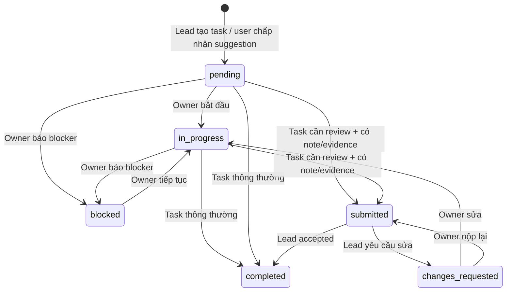

# Product Delivery Task Governance — bản demo nghiệp vụ doanh nghiệp

Ngày kiểm chứng: 2026-08-28

Tài liệu này mô tả phần nghiệp vụ đã chạy thật, không chỉ là kế hoạch. Mục tiêu là demo được một vòng giao việc có trách nhiệm, bằng chứng, phê duyệt và audit; đồng thời giữ LLM ở vai trò phân tích/hỗ trợ thay vì tự quyết định chất lượng công việc.

## 1. Bài toán đã giải quyết

Hệ thống hiện hỗ trợ hai loại công việc:

1. **Task thông thường**: người được giao có thể bắt đầu, báo blocker và hoàn thành.
2. **Task cần Lead review**: người được giao không thể tự đánh dấu hoàn thành. Họ phải nộp kết quả/bằng chứng; Lead chấp nhận hoặc yêu cầu sửa.

Task do AI phát hiện từ hội thoại vẫn ở trạng thái `suggested`. AI không được biến một câu chat thành cam kết chính thức nếu con người chưa chấp nhận. Lead cũng có thể tạo và giao task rõ ràng trên Delivery control plane, không phụ thuộc vào việc AI trích xuất từ chat..

## 2. State machine thực tế



Các rule quan trọng:

- `requires_review=true` chặn owner gọi thẳng `completed`.
- `submitted` chỉ đi qua submission API; `changes_requested` chỉ do Lead review tạo ra.
- Nộp task cần ít nhất submission note hoặc một URL bằng chứng HTTP(S).
- Mọi mutation quan trọng dùng `expected_row_version`; dữ liệu cũ trên UI bị từ chối bằng HTTP 409.
- Task đã vào review không thể bị owner xóa để tránh mất audit trail.
- `submitted` và `changes_requested` vẫn là task chưa hoàn thành trong checkpoint.
- Chỉ `accepted` của Lead mới đặt task review-required thành `completed`.

## 3. Vai trò và quyền

| Nghiệp vụ | Lead | Member/Owner | LLM/Specialist |
|---|---:|---:|---:|
| Tạo và giao team task | Có | Không | Không trực tiếp |
| Bắt đầu/báo blocker task của mình | Có nếu là owner | Có | Chỉ đề xuất qua HITL |
| Nộp bằng chứng task của mình | Có nếu là owner | Có | Không |
| Xem hàng đợi review | Có | Không | Chỉ đọc dữ liệu đã scope khi phân tích |
| Chấp nhận/yêu cầu sửa | Có | Không | Không |
| Tự kết luận chất lượng checkpoint | Không thay Lead | Không | Không |

Quyền được tính từ membership trong database và group participation. Nội dung prompt không thể tự nhận mình là Lead hoặc mở rộng scope.

## 4. Multi-agent xử lý task review ở đâu

Một request như:

```text
Cho tôi tổng quan Delivery Health toàn workspace, gồm checkpoint, blocker và task đang chờ review.
```

được xử lý theo chuỗi sau:

1. API xác thực user, role, Agent Workspace và group scope.
2. Router chọn intent `delivery_health` và mode `multi_specialist`.
3. Supervisor lập DAG và chạy 4 specialist:
   - `task_intelligence`: trạng thái task, overdue, blocker, task đang chờ review/yêu cầu sửa;
   - `planning_forecast`: checkpoint, deadline, dự báo kế hoạch;
   - `risk_dependency`: rủi ro và dependency;
   - `evidence_knowledge`: bằng chứng, quyết định và khoảng trống dữ liệu.
4. Mỗi specialist đọc dữ liệu bằng tool đã được scope ở backend, sau đó dùng LLM của specialist để giải thích typed facts.
5. Workspace Agent dùng một lần gọi LLM synthesis để hợp nhất các specialist result thành câu trả lời cuối.

Các agent không chat tự do trực tiếp với nhau. Chúng giao tiếp qua state/result có schema, dependency trong DAG, upstream result hash và evidence reference. Supervisor là bên điều phối; database/tool layer là nguồn sự thật.

Kết quả runtime đã kiểm chứng ngày 2026-08-28:

```text
intent                 = delivery_health
execution_mode         = multi_specialist
specialists_requested  = 4
specialists_completed  = 4
specialists_failed     = 0
llm_calls              = 5 (4 specialist + 1 synthesis)
submitted              = 1
changes_requested      = 1
```

## 5. System prompt và ranh giới trách nhiệm

Prompt không chứa dữ liệu mật hoặc cấp quyền. Prompt chủ yếu định nghĩa persona, nhiệm vụ, output contract và các điều cấm. Scope/evidence được backend chuẩn bị riêng rồi mới truyền vào runtime.

Các vị trí chính:

- Workspace Agent/synthesis: `src/agents/delivery_supervisor/` và `src/agents/delivery_orchestration/`.
- Specialist prompt: `src/agents/delivery_specialists/prompts.py`.
- Specialist graph/execution: `src/agents/delivery_specialists/graph.py`.
- Typed state/contracts: `src/agents/delivery_orchestration/contracts.py` và `src/agents/schemas/delivery.py`.
- Tool đọc dữ liệu: `src/agents/tools/delivery_analysis.py` và các delivery tool liên quan.

Task Intelligence prompt v3 đã được ràng buộc để phân biệt:

- `submitted`: đã nộp, đang chờ Lead review; chưa hoàn thành;
- `changes_requested`: Lead đã yêu cầu sửa; cần owner tiếp tục;
- `completed`: chỉ coi là hoàn tất khi workflow hợp lệ;
- specialist không được tự phê duyệt chất lượng hoặc bịa bằng chứng.

Độ mạnh của prompt không nên đánh giá bằng cảm giác. Cần eval theo bộ tình huống: route đúng, scope không rò rỉ, không tự approve, không bịa evidence, phân biệt đúng trạng thái và tạo câu trả lời ổn định khi thiếu dữ liệu.

## 6. API nghiệp vụ

Owner/member:

- `PATCH /api/v1/tasks/{task_id}/status`
- `POST /api/v1/tasks/{task_id}/submission`
- `DELETE /api/v1/tasks/{task_id}` — bị chặn nếu task governed đã vào review.

Delivery Lead:

- `POST /api/v1/workspaces/{workspace_id}/agent-workspaces/{agent_workspace_id}/delivery/tasks`
- `GET /api/v1/workspaces/{workspace_id}/agent-workspaces/{agent_workspace_id}/delivery/task-reviews`
- `PATCH /api/v1/workspaces/{workspace_id}/agent-workspaces/{agent_workspace_id}/delivery/tasks/{task_id}/review`

Mỗi submit/review/status mutation có audit event và phát WebSocket event để UI đồng bộ.

## 7. Kịch bản demo khuyến nghị

Services:

- Frontend: `http://localhost:5173`
- Backend: `http://localhost:8000`
- Product Delivery runtime: `http://localhost:8010`

Tài khoản:

- Lead: `delivery-demo-lead@example.com` / `Demo123!`
- Member: `delivery-demo-member@example.com` / `Demo123!`

Kịch bản 5 bước:

1. Lead mở Workspace Agent, chọn một group, tạo team task và bật **Requires Lead review**.
2. Member mở Tasks/My Work, bắt đầu task, nhập result note và evidence URL rồi nộp.
3. Lead thấy task trong **Awaiting Lead review**, chọn **Request changes** và ghi lý do.
4. Member thấy **Changes requested**, sửa, nộp lại với bằng chứng bổ sung.
5. Lead chọn **Accept**; task mới thành `completed`. Mở checkpoint/Delivery Health để chứng minh số liệu đã cập nhật.

Database demo hiện có 46 Product Delivery task với đủ trạng thái: 9 blocked, 12 in progress, 7 pending, 2 suggested, 1 submitted, 1 changes requested, 11 completed và các trạng thái lịch sử khác.

## 8. Mức hoàn thiện và giới hạn trung thực

Đủ cho demo nghiệp vụ doanh nghiệp căn bản:

- assignment rõ ràng;
- owner lifecycle;
- evidence submission;
- Lead review loop;
- RBAC, scope, optimistic locking, audit;
- checkpoint và multi-agent hiểu đúng trạng thái review;
- dữ liệu seed phong phú và UI real-time.

Chưa nên tuyên bố production-complete:

- evidence mới là URL/note, chưa upload file và chưa xác minh chữ ký/checksum;
- chưa đồng bộ Jira/GitHub/GitLab thật;
- chưa có approval nhiều cấp hoặc SLA/escalation engine;
- chưa có notification email/Slack/Teams;
- chưa có browser E2E tự động cho toàn bộ vòng review;
- cần thêm prompt eval/red-team/soak test trước triển khai doanh nghiệp thật.

Hướng phát triển đúng tiếp theo là tích hợp nguồn evidence thật, SLA/escalation, browser E2E và bộ eval prompt định lượng; không cần tăng số agent nếu chưa có một ranh giới nghiệp vụ mới rõ ràng.
